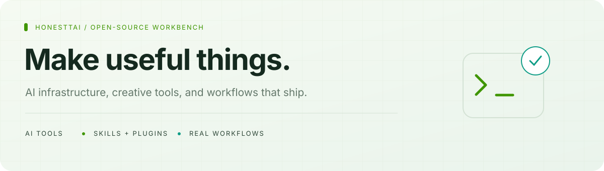

[**English**](README.md) · [简体中文](README.zh-CN.md)

<picture>
  <source media="(prefers-color-scheme: dark)" srcset="assets/hero.svg">
  
</picture>

**Hi, I'm honestTai — the developer and operator behind HRouter.**  
I turn day-to-day problems into practical AI tools, business software, skills, and plugins.

[**Explore HRouter ↗**](https://hrouter.net/home) &nbsp; · &nbsp; [Download the desktop app](https://github.com/honestTai/HRouter-Desktop/releases/latest) &nbsp; · &nbsp; [Get in touch](mailto:honest.tai@outlook.com)

## The public workbench

<picture>
  <source media="(prefers-color-scheme: dark)" srcset="assets/overview.svg">
  
</picture>

**Every public repository is listed below — including forks.** No private projects are included. Counts are scheduled to refresh daily, not in real time.

## Start with these

<table>
<tr>
<td width="50%" valign="top">

### [HRouter Desktop](https://github.com/honestTai/HRouter-Desktop)
**Less configuration. More coding.**

A local-first desktop workbench for AI coding agents, providers, keys, profiles, and model routes. Built on CC Switch, with upstream credits preserved.

[Download for macOS / Windows →](https://github.com/honestTai/HRouter-Desktop/releases/latest)

</td>
<td width="50%" valign="top">

### [ZZ Geo](https://github.com/honestTai/geo-console)
**Evidence first. Then improve.**

Understand brand visibility in AI answers, inspect sources, audit websites, and track content improvements. Provider API samples, not consumer-app answers.

[Explore the interactive demo →](https://www.honesttai.com/interactive/preview.html)

</td>
</tr>
<tr>
<td width="50%" valign="top">

### [SeeHTML AI](https://github.com/honestTai/seehtml-ai)
**An idea → HTML → a presentation or video.**

Create and refine HTML with AI in a local workspace, preview the result, and export PPTX, images, or MP4.

[Explore the creative workflow →](https://github.com/honestTai/seehtml-ai)

</td>
<td width="50%" valign="top">

### [Rent Project](https://github.com/honestTai/rent-project)
**From a rental order to fulfillment.**

Products, orders, electronic contracts, installment bills, and operations. Server and web apps included; Mini Program frontend not included.

[Take the visual tour →](https://github.com/honestTai/rent-project/blob/main/docs/SHOWCASE.md)

</td>
</tr>
</table>

## All public repositories

A complete directory, not just a selection. **Fork** means an upstream-derived repository, not an original project. The trend link opens each project's activity section.

<!-- PUBLIC-REPOS:START -->

| Repository | What it does | Type | Stars | Forks | Trends |
| :--- | :--- | :--- | ---: | ---: | :---: |
| [**geo-console**](https://github.com/honestTai/geo-console) | Evidence-led AI visibility, brand mentions, and content improvements. | Project | 8 | 4 | [↗](https://github.com/honestTai/geo-console#project-activity) |
| [**HRouter-Desktop**](https://github.com/honestTai/HRouter-Desktop) | A local-first workbench for AI coding agents, providers, and model routes. | Project | 6 | 1 | [↗](https://github.com/honestTai/HRouter-Desktop#project-activity) |
| [**rent-project**](https://github.com/honestTai/rent-project) | Rental operations, electronic contracts, installment bills, and fulfillment. | Project | 5 | 0 | [↗](https://github.com/honestTai/rent-project#project-activity) |
| [**seehtml-ai**](https://github.com/honestTai/seehtml-ai) | Create HTML with AI; preview and export presentations, images, and video. | Project | 5 | 0 | [↗](https://github.com/honestTai/seehtml-ai#project-activity) |
| [**tauri-markdown-reader**](https://github.com/honestTai/tauri-markdown-reader) | Read, search, edit, and export local Markdown to Word or PDF. | Project | 5 | 0 | [↗](https://github.com/honestTai/tauri-markdown-reader#project-activity) |
| [**wechat-shop-netCore**](https://github.com/honestTai/wechat-shop-netCore) | A historical ASP.NET Core shop backend for source exploration. | Project | 4 | 0 | [↗](https://github.com/honestTai/wechat-shop-netCore#project-activity) |
| [**seedance-movie-mcp**](https://github.com/honestTai/seedance-movie-mcp) | Scene planning, approved video generation, and clip assembly with Ark. | Project | 3 | 0 | [↗](https://github.com/honestTai/seedance-movie-mcp#project-activity) |
| [**faliang-codex-ex**](https://github.com/honestTai/faliang-codex-ex) | Draft, fact-check, review in WeMD, and prepare WeChat Official Account drafts. | Project | 2 | 0 | [↗](https://github.com/honestTai/faliang-codex-ex#project-activity) |
| [**honestTai**](https://github.com/honestTai/honestTai) | This bilingual profile, public project directory, and transparent metrics. | Profile | 2 | 0 | [↗](https://github.com/honestTai/honestTai#project-activity) |
| [**honestTai-Tool-Xianyu**](https://github.com/honestTai/honestTai-Tool-Xianyu) | Listing monitoring, AI-assisted filtering, and configurable notifications. | Project | 2 | 0 | [↗](https://github.com/honestTai/honestTai-Tool-Xianyu#project-activity) |
| [**hrouter-market-pulse**](https://github.com/honestTai/hrouter-market-pulse) | A market research workbench and Codex plugin for A-share, HK, and US markets. | Project | 2 | 0 | [↗](https://github.com/honestTai/hrouter-market-pulse#project-activity) |
| [**springboot-pet-adoption**](https://github.com/honestTai/springboot-pet-adoption) | 宠物领养管理系统开源：SpringBoot + Vue + MySQL，领养、寄养、救助、用品商城，附开发文档与 PlantUML 图源 | Project | 1 | 0 | [↗](https://github.com/honestTai/springboot-pet-adoption#project-activity) |
| [**campus-mutual-aid-cs**](https://github.com/honestTai/campus-mutual-aid-cs) | 校园互助系统开源（计科版）：SpringBoot + Uni-app 多端小程序 + JWT，闲置交易、表白墙、社区互动，附开发文档 | Project | 0 | 0 | [↗](https://github.com/honestTai/campus-mutual-aid-cs#project-activity) |
| [**campus-mutual-aid-im**](https://github.com/honestTai/campus-mutual-aid-im) | 校园互助系统开源（信息管理版）：SpringBoot + Uni-app + MySQL，学业互助、生活帮助、技能分享，附开发文档 | Project | 0 | 0 | [↗](https://github.com/honestTai/campus-mutual-aid-im#project-activity) |
| [**collaborative-filtering-food-recommendation**](https://github.com/honestTai/collaborative-filtering-food-recommendation) | 美食推荐系统开源：Django + 协同过滤算法 + Scrapy 爬虫，个性化推荐、搜索、收藏，附开发文档 | Project | 0 | 0 | [↗](https://github.com/honestTai/collaborative-filtering-food-recommendation#project-activity) |
| [**cosmetics-ingredients-miniprogram**](https://github.com/honestTai/cosmetics-ingredients-miniprogram) | 美妆成分查询评分小程序开源：微信小程序 + SpringBoot + MyBatis-Plus + Redis，成分对比与评分，附开发文档 | Project | 0 | 0 | [↗](https://github.com/honestTai/cosmetics-ingredients-miniprogram#project-activity) |
| [**flask-recruitment-visualization**](https://github.com/honestTai/flask-recruitment-visualization) | Flask 招聘数据可视化系统开源：Flask + SQLite + ECharts，轻量易部署，附开发文档与 PlantUML 图源 | Project | 0 | 0 | [↗](https://github.com/honestTai/flask-recruitment-visualization#project-activity) |
| [**grad-project-studio**](https://github.com/honestTai/grad-project-studio) | Evidence-linked system design, code, PlantUML, reports, and presentation workflows. | Project | 0 | 0 | [↗](https://github.com/honestTai/grad-project-studio#project-activity) |
| [**house-price-bigdata-analysis**](https://github.com/honestTai/house-price-bigdata-analysis) | 大数据房价分析系统开源：Python 数据采集清洗 + K-means 聚类 + Django + 地图可视化，附开发文档与 PlantUML 图源 | Project | 0 | 0 | [↗](https://github.com/honestTai/house-price-bigdata-analysis#project-activity) |
| [**house-price-ml-visualization**](https://github.com/honestTai/house-price-ml-visualization) | 房价可视化系统开源：Python 爬虫 + K-means 机器学习聚类 + Django + 高德地图可视化，附开发文档与 PlantUML 架构图 | Project | 0 | 0 | [↗](https://github.com/honestTai/house-price-ml-visualization#project-activity) |
| [**microservices-community-errand**](https://github.com/honestTai/microservices-community-errand) | 社区跑腿小程序开源：SpringBoot 微服务 + Nacos + 负载均衡 + 熔断器，下单支付评价全流程，附开发文档 | Project | 0 | 0 | [↗](https://github.com/honestTai/microservices-community-errand#project-activity) |
| [**php-property-management**](https://github.com/honestTai/php-property-management) | PHP 物业管理系统开源：FastAdmin（ThinkPHP5）+ MySQL，含业主、缴费、报修、车位、设备管理完整源码 | Project | 0 | 0 | [↗](https://github.com/honestTai/php-property-management#project-activity) |
| [**python-novel-data-analysis**](https://github.com/honestTai/python-novel-data-analysis) | Python 小说数据分析系统开源：爬虫 + Spark SQL + SpringBoot + Vue 可视化，附开发文档与 PlantUML 图源 | Project | 0 | 0 | [↗](https://github.com/honestTai/python-novel-data-analysis#project-activity) |
| [**python-web-security-scanner**](https://github.com/honestTai/python-web-security-scanner) | Web 安全检测系统开源：Python + Flask + Vue，Nmap 端口扫描、POC 漏洞检测、CMS 指纹识别，附开发文档 | Project | 0 | 0 | [↗](https://github.com/honestTai/python-web-security-scanner#project-activity) |
| [**recruitment-data-visualization**](https://github.com/honestTai/recruitment-data-visualization) | 招聘数据可视化系统开源：Scrapy 爬虫 + Flask + Vue + ECharts 大屏，含协同过滤岗位推荐，附开发文档 | Project | 0 | 0 | [↗](https://github.com/honestTai/recruitment-data-visualization#project-activity) |
| [**spark-takeaway-data-analysis**](https://github.com/honestTai/spark-takeaway-data-analysis) | Spark 外卖数据分析系统开源：Spark 分布式计算 + SpringBoot + Vue + ECharts 可视化，附开发文档与 PlantUML 图源 | Project | 0 | 0 | [↗](https://github.com/honestTai/spark-takeaway-data-analysis#project-activity) |
| [**springboot-building-materials**](https://github.com/honestTai/springboot-building-materials) | SpringBoot 微服务建筑材料管理系统开源：Nacos + Vue + MySQL + RBAC 权限，附开发文档与架构图 | Project | 0 | 0 | [↗](https://github.com/honestTai/springboot-building-materials#project-activity) |
| [**tourism-perception-bigdata**](https://github.com/honestTai/tourism-perception-bigdata) | 游客感知大数据分析系统开源：Python 爬虫 + NLP 情感分析 + Flask + Vue 可视化，附开发文档与 PlantUML 图源 | Project | 0 | 0 | [↗](https://github.com/honestTai/tourism-perception-bigdata#project-activity) |
| [**vue-community-food-ordering**](https://github.com/honestTai/vue-community-food-ordering) | 社区点餐小程序开源：Uni-app + SpringBoot + MySQL，在线点餐、菜单推荐、订单管理，附开发文档与 PlantUML 图源 | Project | 0 | 0 | [↗](https://github.com/honestTai/vue-community-food-ordering#project-activity) |
| [**vue-game-company-website**](https://github.com/honestTai/vue-game-company-website) | 游戏公司官网开源：Vue + Node.js(Koa) + MySQL，产品展示、新闻、招聘前后台，附开发文档与 PlantUML 图源 | Project | 0 | 0 | [↗](https://github.com/honestTai/vue-game-company-website#project-activity) |
| [**vue-library-management**](https://github.com/honestTai/vue-library-management) | 图书管理系统开源：Vue + SpringBoot + MyBatis + MySQL，借还书、会员、分类管理完整实现，附开发文档 | Project | 0 | 0 | [↗](https://github.com/honestTai/vue-library-management#project-activity) |
| [**vue-springboot-gym-management**](https://github.com/honestTai/vue-springboot-gym-management) | 健身房管理系统开源：Vue + SpringBoot + MySQL，会员、课程、打卡、器材、充值订单完整源码 | Project | 0 | 0 | [↗](https://github.com/honestTai/vue-springboot-gym-management#project-activity) |
| [**vue-springboot-photo-sharing**](https://github.com/honestTai/vue-springboot-photo-sharing) | 共享图片系统开源：Vue + SpringBoot 前后端分离，图片加密分享、以图识图，附开发文档与 PlantUML 图源 | Project | 0 | 0 | [↗](https://github.com/honestTai/vue-springboot-photo-sharing#project-activity) |
| [**zongheng-novel-bigdata-analysis**](https://github.com/honestTai/zongheng-novel-bigdata-analysis) | 小说网站大数据分析系统开源：Scrapy + Spark SQL + SpringBoot + Vue 交互式可视化，附开发文档与 PlantUML 图源 | Project | 0 | 0 | [↗](https://github.com/honestTai/zongheng-novel-bigdata-analysis#project-activity) |
| [**awesome-lint**](https://github.com/honestTai/awesome-lint) | Fork of the linter for Awesome lists. | Fork | 2 | 0 | [↗](https://github.com/honestTai/awesome-lint#project-activity) |
| [**cc-switch**](https://github.com/honestTai/cc-switch) | Fork of the cross-platform configuration assistant for AI coding tools. | Fork | 2 | 0 | [↗](https://github.com/honestTai/cc-switch#project-activity) |
| [**sub2api-1**](https://github.com/honestTai/sub2api-1) | Security research fork of Wei-Shaw/sub2api — EasyPay payment callback forgery fix, merged upstream as PR #7888 and shipped in v0.2.14. | Fork | 0 | 0 | [↗](https://github.com/honestTai/sub2api-1#project-activity) |

<!-- PUBLIC-REPOS:END -->

## Upstream contributions

### sub2api · Critical payment vulnerability fix — merged and released

Independently discovered and fixed an EasyPay payment-callback forgery vulnerability (Critical) in the [Wei-Shaw/sub2api](https://github.com/Wei-Shaw/sub2api) AI gateway: an attacker could forge successful payment callbacks without the merchant key and credit any balance at zero cost. Reported with a PoC, patched, merged by the maintainer, and shipped in the official **v0.2.14** release.

- [Issue #7881 · vulnerability report](https://github.com/Wei-Shaw/sub2api/issues/7881)
- [PR #7888 · fix, merged](https://github.com/Wei-Shaw/sub2api/pull/7888)
- [v0.2.14 release notes](https://github.com/Wei-Shaw/sub2api/releases/tag/v0.2.14)

The fix applies defense in depth: callback parameter allowlist verification, return_url query stripping, and asynchronous post-crediting upstream reconciliation.

## How I build

- **Useful before flashy.** Tools grounded in actual development, writing, research, and business workflows.
- **Local where it matters.** Desktop and document tools that work around your own files and projects.
- **Evidence over claims.** Clearly labeled demo data, explicit limitations, and traceable research outputs.
- **Credit the foundations.** Upstream projects, licenses, and dependencies remain visible.

## HRouter · model access for builders

I also build and operate [**HRouter**](https://hrouter.net/home): model access, API key management, and usage tracking for AI coding and application development. Explore the service when it fits your workflow; each project's own documentation explains its requirements.

## Project activity

<picture>
  <source media="(prefers-color-scheme: dark)" srcset="assets/metrics/honestTai.svg">
  
</picture>

[**Explore all Star / Fork charts →**](data/README.md) · [Observed daily totals](assets/metrics/honestTai-daily.svg) · [Data and methodology](data/METHODOLOGY.md) · [Refresh status](https://github.com/honestTai/honestTai/actions/workflows/public-metrics.yml)

Historical curves reconstruct currently retained stars and visible forks, not past net totals. Separate daily snapshots start on October 6, 2026. No invented backfill, no third-party stats-image dependency.

---

**Try something useful. Open an issue. Build on it.**  
For deployment, customization, and collaboration: [honest.tai@outlook.com](mailto:honest.tai@outlook.com).
