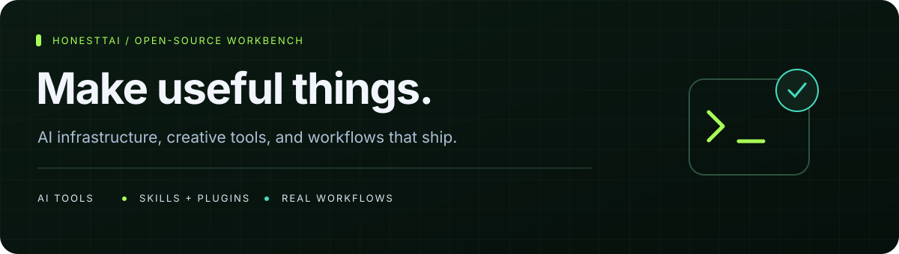
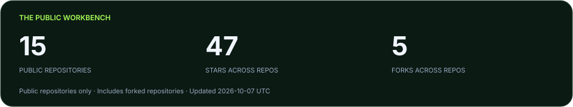
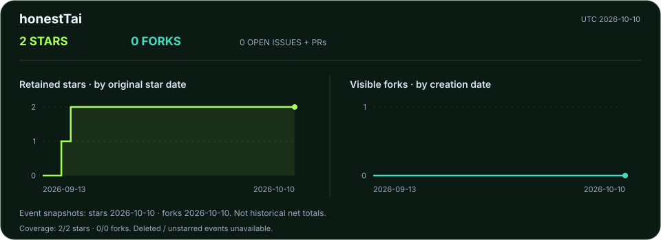

[**English**](README.md) · [简体中文](README.zh-CN.md)

**Hi, I'm honestTai — the developer and operator behind HRouter.**  
I turn day-to-day problems into practical AI tools, business software, skills, and plugins.

[**Explore HRouter ↗**](https://hrouter.net/home) &nbsp; · &nbsp; [Download the desktop app](https://github.com/honestTai/HRouter-Desktop/releases/latest) &nbsp; · &nbsp; [Get in touch](mailto:honest.tai@outlook.com)

## The public workbench

**Every public repository is listed below — including forks.** No private projects are included. Counts are scheduled to refresh daily, not in real time.

## Start with these

<table>
<tr>
<td width="50%" valign="top">

### [HRouter Desktop](https://github.com/honestTai/HRouter-Desktop)
**Less configuration. More coding.**

A local-first desktop workbench for AI coding agents, providers, keys, profiles, and model routes. Built on CC Switch, with upstream credits preserved.

[Download for macOS / Windows →](https://github.com/honestTai/HRouter-Desktop/releases/latest)

</td>
<td width="50%" valign="top">

### [ZZ Geo](https://github.com/honestTai/geo-console)
**Evidence first. Then improve.**

Understand brand visibility in AI answers, inspect sources, audit websites, and track content improvements. Provider API samples, not consumer-app answers.

[Explore the interactive demo →](https://www.honesttai.com/interactive/preview.html)

</td>
</tr>
<tr>
<td width="50%" valign="top">

### [SeeHTML AI](https://github.com/honestTai/seehtml-ai)
**An idea → HTML → a presentation or video.**

Create and refine HTML with AI in a local workspace, preview the result, and export PPTX, images, or MP4.

[Explore the creative workflow →](https://github.com/honestTai/seehtml-ai)

</td>
<td width="50%" valign="top">

### [Rent Project](https://github.com/honestTai/rent-project)
**From a rental order to fulfillment.**

Products, orders, electronic contracts, installment bills, and operations. Server and web apps included; Mini Program frontend not included.

[Take the visual tour →](https://github.com/honestTai/rent-project/blob/main/docs/SHOWCASE.md)

</td>
</tr>
</table>

## All public repositories

A complete directory, not just a selection. **Fork** means an upstream-derived repository, not an original project. The trend link opens each project's activity section.

<!-- PUBLIC-REPOS:START -->

| Repository | What it does | Type | Stars | Forks | Trends |
| :--- | :--- | :--- | ---: | ---: | :---: |
| [**geo-console**](https://github.com/honestTai/geo-console) | Evidence-led AI visibility, brand mentions, and content improvements. | Project | 8 | 4 | [↗](https://github.com/honestTai/geo-console#project-activity) |
| [**HRouter-Desktop**](https://github.com/honestTai/HRouter-Desktop) | A local-first workbench for AI coding agents, providers, and model routes. | Project | 5 | 1 | [↗](https://github.com/honestTai/HRouter-Desktop#project-activity) |
| [**rent-project**](https://github.com/honestTai/rent-project) | Rental operations, electronic contracts, installment bills, and fulfillment. | Project | 5 | 0 | [↗](https://github.com/honestTai/rent-project#project-activity) |
| [**seehtml-ai**](https://github.com/honestTai/seehtml-ai) | Create HTML with AI; preview and export presentations, images, and video. | Project | 5 | 0 | [↗](https://github.com/honestTai/seehtml-ai#project-activity) |
| [**tauri-markdown-reader**](https://github.com/honestTai/tauri-markdown-reader) | Read, search, edit, and export local Markdown to Word or PDF. | Project | 5 | 0 | [↗](https://github.com/honestTai/tauri-markdown-reader#project-activity) |
| [**wechat-shop-netCore**](https://github.com/honestTai/wechat-shop-netCore) | A historical ASP.NET Core shop backend for source exploration. | Project | 4 | 0 | [↗](https://github.com/honestTai/wechat-shop-netCore#project-activity) |
| [**seedance-movie-mcp**](https://github.com/honestTai/seedance-movie-mcp) | Scene planning, approved video generation, and clip assembly with Ark. | Project | 3 | 0 | [↗](https://github.com/honestTai/seedance-movie-mcp#project-activity) |
| [**faliang-codex-ex**](https://github.com/honestTai/faliang-codex-ex) | Draft, fact-check, review in WeMD, and prepare WeChat Official Account drafts. | Project | 2 | 0 | [↗](https://github.com/honestTai/faliang-codex-ex#project-activity) |
| [**honestTai**](https://github.com/honestTai/honestTai) | This bilingual profile, public project directory, and transparent metrics. | Profile | 2 | 0 | [↗](https://github.com/honestTai/honestTai#project-activity) |
| [**honestTai-Tool-Xianyu**](https://github.com/honestTai/honestTai-Tool-Xianyu) | Listing monitoring, AI-assisted filtering, and configurable notifications. | Project | 2 | 0 | [↗](https://github.com/honestTai/honestTai-Tool-Xianyu#project-activity) |
| [**hrouter-market-pulse**](https://github.com/honestTai/hrouter-market-pulse) | A market research workbench and Codex plugin for A-share, HK, and US markets. | Project | 2 | 0 | [↗](https://github.com/honestTai/hrouter-market-pulse#project-activity) |
| [**grad-project-studio**](https://github.com/honestTai/grad-project-studio) | Evidence-linked system design, code, PlantUML, reports, and presentation workflows. | Project | 0 | 0 | [↗](https://github.com/honestTai/grad-project-studio#project-activity) |
| [**awesome-lint**](https://github.com/honestTai/awesome-lint) | Fork of the linter for Awesome lists. | Fork | 2 | 0 | [↗](https://github.com/honestTai/awesome-lint#project-activity) |
| [**cc-switch**](https://github.com/honestTai/cc-switch) | Fork of the cross-platform configuration assistant for AI coding tools. | Fork | 2 | 0 | [↗](https://github.com/honestTai/cc-switch#project-activity) |
| [**sub2api-1**](https://github.com/honestTai/sub2api-1) | Sub2API 一站式开源中转服务，让 Claude、Openai 、Gemini、Grok订阅统一接入，支持拼车共享，更高效分摊成本，原生工具无缝使用。 | Fork | 0 | 0 | [↗](https://github.com/honestTai/sub2api-1#project-activity) |

<!-- PUBLIC-REPOS:END -->

## Upstream contributions

### sub2api · Critical payment vulnerability fix — merged and released

Independently discovered and fixed an EasyPay payment-callback forgery vulnerability (Critical) in the [Wei-Shaw/sub2api](https://github.com/Wei-Shaw/sub2api) AI gateway: an attacker could forge successful payment callbacks without the merchant key and credit any balance at zero cost. Reported with a PoC, patched, merged by the maintainer, and shipped in the official **v0.2.14** release.

- [Issue #7881 · vulnerability report](https://github.com/Wei-Shaw/sub2api/issues/7881)
- [PR #7888 · fix, merged](https://github.com/Wei-Shaw/sub2api/pull/7888)
- [v0.2.14 release notes](https://github.com/Wei-Shaw/sub2api/releases/tag/v0.2.14)

The fix applies defense in depth: callback parameter allowlist verification, return_url query stripping, and asynchronous post-crediting upstream reconciliation.

## How I build

- **Useful before flashy.** Tools grounded in actual development, writing, research, and business workflows.
- **Local where it matters.** Desktop and document tools that work around your own files and projects.
- **Evidence over claims.** Clearly labeled demo data, explicit limitations, and traceable research outputs.
- **Credit the foundations.** Upstream projects, licenses, and dependencies remain visible.

## HRouter · model access for builders

I also build and operate [**HRouter**](https://hrouter.net/home): model access, API key management, and usage tracking for AI coding and application development. Explore the service when it fits your workflow; each project's own documentation explains its requirements.

## Project activity

[**Explore all Star / Fork charts →**](data/README.md) · [Observed daily totals](assets/metrics/honestTai-daily.svg) · [Data and methodology](data/METHODOLOGY.md) · [Refresh status](https://github.com/honestTai/honestTai/actions/workflows/public-metrics.yml)

Historical curves reconstruct currently retained stars and visible forks, not past net totals. Separate daily snapshots start on October 6, 2026. No invented backfill, no third-party stats-image dependency.

---

**Try something useful. Open an issue. Build on it.**  
For deployment, customization, and collaboration: [honest.tai@outlook.com](mailto:honest.tai@outlook.com).
