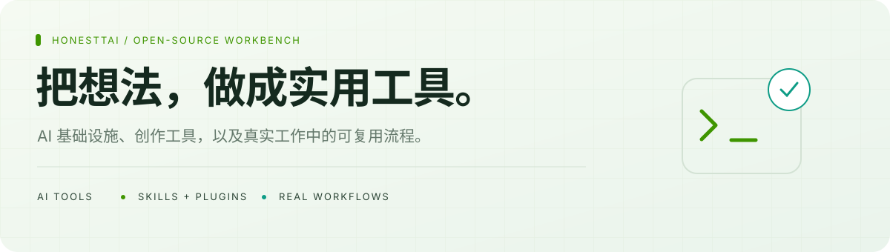
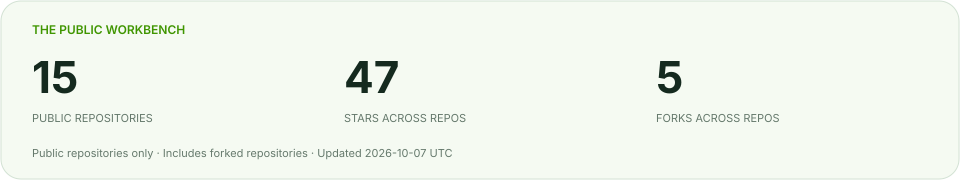
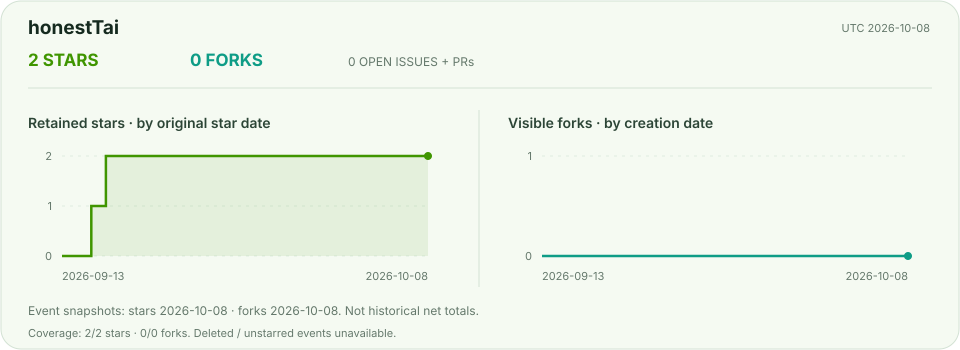

[English](README.md) · **简体中文**

<picture>
  <source media="(prefers-color-scheme: dark)" srcset="assets/hero.zh-CN.svg">
  
</picture>

**你好，我是 honestTai，HRouter 的开发者与运营者。**  
把日常工作中的需求，做成实用的 AI 工具、业务软件、Skills 与插件。

[**了解 HRouter ↗**](https://hrouter.net/home) &nbsp; · &nbsp; [下载桌面客户端](https://github.com/honestTai/HRouter-Desktop/releases/latest) &nbsp; · &nbsp; [联系我](mailto:honest.tai@outlook.com)

## 我的公开项目工作台

<picture>
  <source media="(prefers-color-scheme: dark)" srcset="assets/overview.svg">
  
</picture>

**下方展示全部公开仓库，包括 Fork。** 不包含私有项目；统计计划每日更新，并非实时行情。

## 从这些项目开始

| 项目 | 解决什么问题 | 开始体验 |
| :--- | :--- | :--- |
| [**HRouter Desktop**](https://github.com/honestTai/HRouter-Desktop) | 在一个本地工作台管理 AI 编程工具、供应商、密钥、配置与模型路由。基于 CC Switch，保留上游署名。 | [macOS / Windows 下载](https://github.com/honestTai/HRouter-Desktop/releases/latest) |
| [**ZZ Geo**](https://github.com/honestTai/geo-console) | 查看 AI 回答中的品牌提及与来源，审计官网，跟进内容整改。数据来自供应商 API，不等同于消费端 App 回答。 | [交互演示](https://www.honesttai.com/interactive/preview.html) |
| [**SeeHTML AI**](https://github.com/honestTai/seehtml-ai) | 在本地工作区借助 AI 创作与预览 HTML，再导出 PPTX、图片和 MP4。 | [项目介绍](https://github.com/honestTai/seehtml-ai) |
| [**Rent Project**](https://github.com/honestTai/rent-project) | 串联商品、租赁订单、电子合同、分期账单与履约。包含服务端和 Web 应用，不含小程序前端。 | [图文导览](https://github.com/honestTai/rent-project/blob/main/docs/SHOWCASE.md) |

## 全部公开仓库

完整展示，不只列精选项目。**Fork** 表示上游衍生仓库，不包装成原创。点击趋势可查看对应项目的数据。

<!-- PUBLIC-REPOS:START -->

| 仓库 | 简介 | 类型 | Stars | Forks | 趋势 |
| :--- | :--- | :--- | ---: | ---: | :---: |
| [**geo-console**](https://github.com/honestTai/geo-console) | 基于证据的 AI 可见性监测、品牌提及与内容整改。 | 项目 | 8 | 4 | [↗](https://github.com/honestTai/geo-console#project-activity) |
| [**HRouter-Desktop**](https://github.com/honestTai/HRouter-Desktop) | AI 编程工具、供应商配置与模型路由的本地优先工作台。 | 项目 | 6 | 1 | [↗](https://github.com/honestTai/HRouter-Desktop#project-activity) |
| [**rent-project**](https://github.com/honestTai/rent-project) | 租赁运营、电子合同、分期账单与履约管理。 | 项目 | 5 | 0 | [↗](https://github.com/honestTai/rent-project#project-activity) |
| [**seehtml-ai**](https://github.com/honestTai/seehtml-ai) | AI 创作 HTML，预览并导出演示文稿、图片与视频。 | 项目 | 5 | 0 | [↗](https://github.com/honestTai/seehtml-ai#project-activity) |
| [**tauri-markdown-reader**](https://github.com/honestTai/tauri-markdown-reader) | 阅读、搜索、编辑本地 Markdown，导出 Word 或 PDF。 | 项目 | 5 | 0 | [↗](https://github.com/honestTai/tauri-markdown-reader#project-activity) |
| [**wechat-shop-netCore**](https://github.com/honestTai/wechat-shop-netCore) | 用于源码阅读的历史 ASP.NET Core 商城后端。 | 项目 | 4 | 0 | [↗](https://github.com/honestTai/wechat-shop-netCore#project-activity) |
| [**seedance-movie-mcp**](https://github.com/honestTai/seedance-movie-mcp) | 火山方舟分镜规划、确认后的视频生成与片段拼接。 | 项目 | 3 | 0 | [↗](https://github.com/honestTai/seedance-movie-mcp#project-activity) |
| [**faliang-codex-ex**](https://github.com/honestTai/faliang-codex-ex) | 写稿、事实核验、WeMD 审稿与微信公众号草稿工作流。 | 项目 | 2 | 0 | [↗](https://github.com/honestTai/faliang-codex-ex#project-activity) |
| [**honestTai**](https://github.com/honestTai/honestTai) | 双语个人主页、全部公开项目目录与透明统计。 | 个人主页 | 2 | 0 | [↗](https://github.com/honestTai/honestTai#project-activity) |
| [**honestTai-Tool-Xianyu**](https://github.com/honestTai/honestTai-Tool-Xianyu) | 商品监测、AI 辅助筛选与多渠道通知。 | 项目 | 2 | 0 | [↗](https://github.com/honestTai/honestTai-Tool-Xianyu#project-activity) |
| [**hrouter-market-pulse**](https://github.com/honestTai/hrouter-market-pulse) | A 股、港股与美股研究工作台及 Codex 插件。 | 项目 | 2 | 0 | [↗](https://github.com/honestTai/hrouter-market-pulse#project-activity) |
| [**campus-mutual-aid-cs**](https://github.com/honestTai/campus-mutual-aid-cs) | 校园互助系统开源（计科版）：SpringBoot + Uni-app 多端小程序 + JWT，闲置交易、表白墙、社区互动，附开发文档 | 项目 | 0 | 0 | [↗](https://github.com/honestTai/campus-mutual-aid-cs#project-activity) |
| [**campus-mutual-aid-im**](https://github.com/honestTai/campus-mutual-aid-im) | 校园互助系统开源（信息管理版）：SpringBoot + Uni-app + MySQL，学业互助、生活帮助、技能分享，附开发文档 | 项目 | 0 | 0 | [↗](https://github.com/honestTai/campus-mutual-aid-im#project-activity) |
| [**collaborative-filtering-food-recommendation**](https://github.com/honestTai/collaborative-filtering-food-recommendation) | 美食推荐系统开源：Django + 协同过滤算法 + Scrapy 爬虫，个性化推荐、搜索、收藏，附开发文档 | 项目 | 0 | 0 | [↗](https://github.com/honestTai/collaborative-filtering-food-recommendation#project-activity) |
| [**cosmetics-ingredients-miniprogram**](https://github.com/honestTai/cosmetics-ingredients-miniprogram) | 美妆成分查询评分小程序开源：微信小程序 + SpringBoot + MyBatis-Plus + Redis，成分对比与评分，附开发文档 | 项目 | 0 | 0 | [↗](https://github.com/honestTai/cosmetics-ingredients-miniprogram#project-activity) |
| [**flask-recruitment-visualization**](https://github.com/honestTai/flask-recruitment-visualization) | Flask 招聘数据可视化系统开源：Flask + SQLite + ECharts，轻量易部署，附开发文档与 PlantUML 图源 | 项目 | 0 | 0 | [↗](https://github.com/honestTai/flask-recruitment-visualization#project-activity) |
| [**grad-project-studio**](https://github.com/honestTai/grad-project-studio) | 串联真实证据的系统设计、代码、PlantUML、报告与答辩工作流。 | 项目 | 0 | 0 | [↗](https://github.com/honestTai/grad-project-studio#project-activity) |
| [**house-price-bigdata-analysis**](https://github.com/honestTai/house-price-bigdata-analysis) | 大数据房价分析系统开源：Python 数据采集清洗 + K-means 聚类 + Django + 地图可视化，附开发文档与 PlantUML 图源 | 项目 | 0 | 0 | [↗](https://github.com/honestTai/house-price-bigdata-analysis#project-activity) |
| [**house-price-ml-visualization**](https://github.com/honestTai/house-price-ml-visualization) | 房价可视化系统开源：Python 爬虫 + K-means 机器学习聚类 + Django + 高德地图可视化，附开发文档与 PlantUML 架构图 | 项目 | 0 | 0 | [↗](https://github.com/honestTai/house-price-ml-visualization#project-activity) |
| [**microservices-community-errand**](https://github.com/honestTai/microservices-community-errand) | 社区跑腿小程序开源：SpringBoot 微服务 + Nacos + 负载均衡 + 熔断器，下单支付评价全流程，附开发文档 | 项目 | 0 | 0 | [↗](https://github.com/honestTai/microservices-community-errand#project-activity) |
| [**php-property-management**](https://github.com/honestTai/php-property-management) | PHP 物业管理系统开源：FastAdmin（ThinkPHP5）+ MySQL，含业主、缴费、报修、车位、设备管理完整源码 | 项目 | 0 | 0 | [↗](https://github.com/honestTai/php-property-management#project-activity) |
| [**python-novel-data-analysis**](https://github.com/honestTai/python-novel-data-analysis) | Python 小说数据分析系统开源：爬虫 + Spark SQL + SpringBoot + Vue 可视化，附开发文档与 PlantUML 图源 | 项目 | 0 | 0 | [↗](https://github.com/honestTai/python-novel-data-analysis#project-activity) |
| [**python-web-security-scanner**](https://github.com/honestTai/python-web-security-scanner) | Web 安全检测系统开源：Python + Flask + Vue，Nmap 端口扫描、POC 漏洞检测、CMS 指纹识别，附开发文档 | 项目 | 0 | 0 | [↗](https://github.com/honestTai/python-web-security-scanner#project-activity) |
| [**recruitment-data-visualization**](https://github.com/honestTai/recruitment-data-visualization) | 招聘数据可视化系统开源：Scrapy 爬虫 + Flask + Vue + ECharts 大屏，含协同过滤岗位推荐，附开发文档 | 项目 | 0 | 0 | [↗](https://github.com/honestTai/recruitment-data-visualization#project-activity) |
| [**spark-takeaway-data-analysis**](https://github.com/honestTai/spark-takeaway-data-analysis) | Spark 外卖数据分析系统开源：Spark 分布式计算 + SpringBoot + Vue + ECharts 可视化，附开发文档与 PlantUML 图源 | 项目 | 0 | 0 | [↗](https://github.com/honestTai/spark-takeaway-data-analysis#project-activity) |
| [**springboot-building-materials**](https://github.com/honestTai/springboot-building-materials) | SpringBoot 微服务建筑材料管理系统开源：Nacos + Vue + MySQL + RBAC 权限，附开发文档与架构图 | 项目 | 0 | 0 | [↗](https://github.com/honestTai/springboot-building-materials#project-activity) |
| [**springboot-pet-adoption**](https://github.com/honestTai/springboot-pet-adoption) | 宠物领养管理系统开源：SpringBoot + Vue + MySQL，领养、寄养、救助、用品商城，附开发文档与 PlantUML 图源 | 项目 | 0 | 0 | [↗](https://github.com/honestTai/springboot-pet-adoption#project-activity) |
| [**tourism-perception-bigdata**](https://github.com/honestTai/tourism-perception-bigdata) | 游客感知大数据分析系统开源：Python 爬虫 + NLP 情感分析 + Flask + Vue 可视化，附开发文档与 PlantUML 图源 | 项目 | 0 | 0 | [↗](https://github.com/honestTai/tourism-perception-bigdata#project-activity) |
| [**vue-community-food-ordering**](https://github.com/honestTai/vue-community-food-ordering) | 社区点餐小程序开源：Uni-app + SpringBoot + MySQL，在线点餐、菜单推荐、订单管理，附开发文档与 PlantUML 图源 | 项目 | 0 | 0 | [↗](https://github.com/honestTai/vue-community-food-ordering#project-activity) |
| [**vue-game-company-website**](https://github.com/honestTai/vue-game-company-website) | 游戏公司官网开源：Vue + Node.js(Koa) + MySQL，产品展示、新闻、招聘前后台，附开发文档与 PlantUML 图源 | 项目 | 0 | 0 | [↗](https://github.com/honestTai/vue-game-company-website#project-activity) |
| [**vue-library-management**](https://github.com/honestTai/vue-library-management) | 图书管理系统开源：Vue + SpringBoot + MyBatis + MySQL，借还书、会员、分类管理完整实现，附开发文档 | 项目 | 0 | 0 | [↗](https://github.com/honestTai/vue-library-management#project-activity) |
| [**vue-springboot-gym-management**](https://github.com/honestTai/vue-springboot-gym-management) | 健身房管理系统开源：Vue + SpringBoot + MySQL，会员、课程、打卡、器材、充值订单完整源码 | 项目 | 0 | 0 | [↗](https://github.com/honestTai/vue-springboot-gym-management#project-activity) |
| [**vue-springboot-photo-sharing**](https://github.com/honestTai/vue-springboot-photo-sharing) | 共享图片系统开源：Vue + SpringBoot 前后端分离，图片加密分享、以图识图，附开发文档与 PlantUML 图源 | 项目 | 0 | 0 | [↗](https://github.com/honestTai/vue-springboot-photo-sharing#project-activity) |
| [**zongheng-novel-bigdata-analysis**](https://github.com/honestTai/zongheng-novel-bigdata-analysis) | 小说网站大数据分析系统开源：Scrapy + Spark SQL + SpringBoot + Vue 交互式可视化，附开发文档与 PlantUML 图源 | 项目 | 0 | 0 | [↗](https://github.com/honestTai/zongheng-novel-bigdata-analysis#project-activity) |
| [**awesome-lint**](https://github.com/honestTai/awesome-lint) | Awesome 清单规范检查工具的 Fork。 | Fork · 上游衍生 | 2 | 0 | [↗](https://github.com/honestTai/awesome-lint#project-activity) |
| [**cc-switch**](https://github.com/honestTai/cc-switch) | 跨平台 AI 编程工具配置助手的 Fork。 | Fork · 上游衍生 | 2 | 0 | [↗](https://github.com/honestTai/cc-switch#project-activity) |
| [**sub2api-1**](https://github.com/honestTai/sub2api-1) | Security research fork of Wei-Shaw/sub2api — EasyPay payment callback forgery fix, merged upstream as PR #7888 and shipped in v0.2.14. | Fork · 上游衍生 | 0 | 0 | [↗](https://github.com/honestTai/sub2api-1#project-activity) |

<!-- PUBLIC-REPOS:END -->

## 上游开源贡献

### sub2api · 关键支付漏洞修复（已合并发版）

独立发现并修复 [Wei-Shaw/sub2api](https://github.com/Wei-Shaw/sub2api) AI 网关的 EasyPay 支付回调伪造漏洞（Critical）：攻击者无需商户密钥即可伪造支付成功回调，实现 0 元充值任意金额。完成 PoC 复现、漏洞报告与修复实现，被项目作者合并后随官方 **v0.2.14** 版本发布，修复写入 Release Notes。

- [Issue #7881 · 漏洞报告](https://github.com/Wei-Shaw/sub2api/issues/7881)
- [PR #7888 · 修复实现（已合并）](https://github.com/Wei-Shaw/sub2api/pull/7888)
- [v0.2.14 Release Notes](https://github.com/Wei-Shaw/sub2api/releases/tag/v0.2.14)

修复采用三层纵深防御：回调参数白名单验签、return_url 查询参数剥离、入账后异步上游对账。

## 我的开发取向

- **先实用，再炫技。** 围绕开发、写作、研究和业务中的真实需求。
- **适合本地的，就留在本地。** 桌面与文档工具围绕自己的文件和项目工作。
- **用证据说话。** 明确区分演示数据、能力边界和可追溯研究结果。
- **尊重上游。** 保留原项目、许可证与依赖的署名。

## HRouter · 面向开发者的模型接入

我也开发和运营 [**HRouter**](https://hrouter.net/home)，提供 AI 编程与应用开发中的模型接入、密钥管理与用量查询。是否需要该服务，以各项目自身文档说明为准。

## 项目动态

<picture>
  <source media="(prefers-color-scheme: dark)" srcset="assets/metrics/honestTai.svg">
  
</picture>

[**查看所有 Star / Fork 趋势 →**](data/README.md) · [每日实测总量](assets/metrics/honestTai-daily.svg) · [数据口径](data/METHODOLOGY.zh-CN.md) · [更新状态](https://github.com/honestTai/honestTai/actions/workflows/public-metrics.yml)

历史曲线按当前留存的 Star 与可见 Fork 的事件时间重建，不代表过去每日净总量。独立的每日实测记录从 2026 年 10 月 6 日开始，不伪造历史，不依赖第三方统计图片服务。

---

**找到喜欢的项目，试一试；遇到问题，欢迎提 Issue。**  
部署、定制与合作：[honest.tai@outlook.com](mailto:honest.tai@outlook.com)。
