# Public repository metrics

[Portfolio](../README.md) · [中文说明](METHODOLOGY.zh-CN.md) · [Methodology](METHODOLOGY.md)

Observed at **2026-10-08T01:50:59Z**. All 15 public repositories, including forks.

## awesome-lint

[Repository](https://github.com/honestTai/awesome-lint)

<picture><source media="(prefers-color-scheme: dark)" srcset="../assets/metrics/awesome-lint.svg">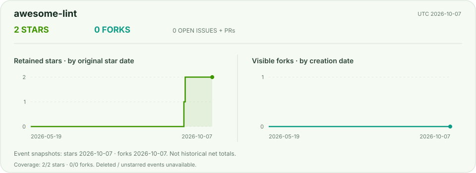</picture>

<picture><source media="(prefers-color-scheme: dark)" srcset="../assets/metrics/awesome-lint-daily.svg">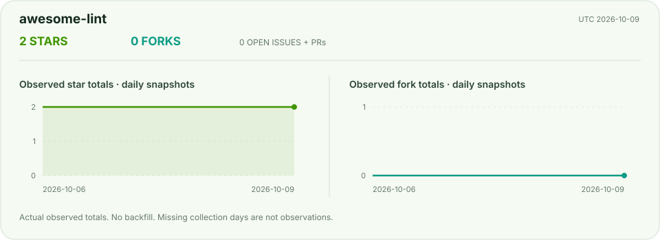</picture>

## cc-switch

[Repository](https://github.com/honestTai/cc-switch)

<picture><source media="(prefers-color-scheme: dark)" srcset="../assets/metrics/cc-switch.svg">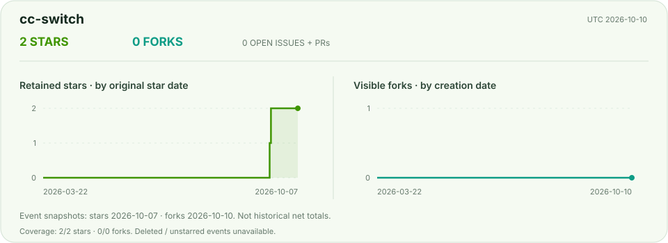</picture>

<picture><source media="(prefers-color-scheme: dark)" srcset="../assets/metrics/cc-switch-daily.svg">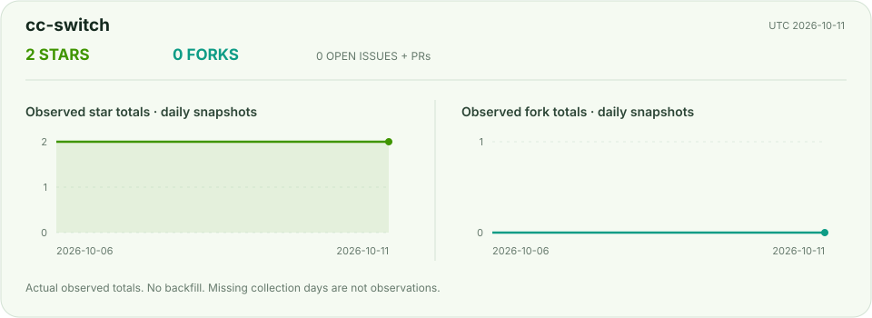</picture>

## faliang-codex-ex

[Repository](https://github.com/honestTai/faliang-codex-ex)

<picture><source media="(prefers-color-scheme: dark)" srcset="../assets/metrics/faliang-codex-ex.svg">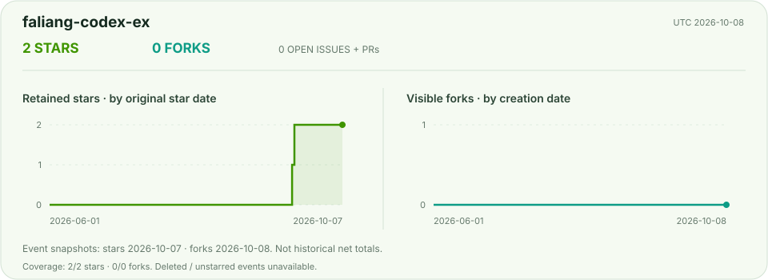</picture>

<picture><source media="(prefers-color-scheme: dark)" srcset="../assets/metrics/faliang-codex-ex-daily.svg">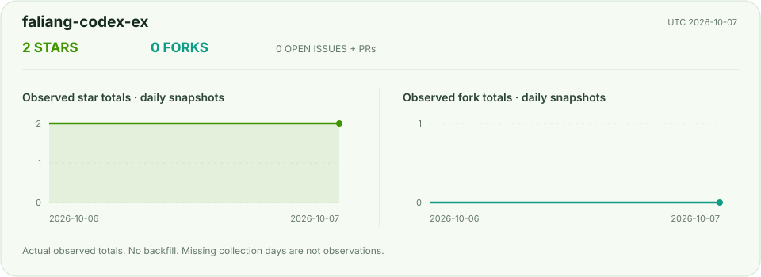</picture>

## geo-console

[Repository](https://github.com/honestTai/geo-console)

<picture><source media="(prefers-color-scheme: dark)" srcset="../assets/metrics/geo-console.svg">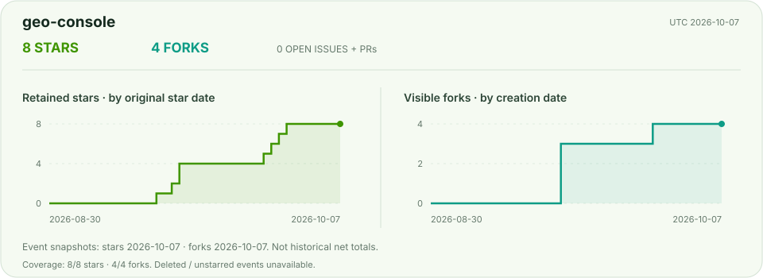</picture>

<picture><source media="(prefers-color-scheme: dark)" srcset="../assets/metrics/geo-console-daily.svg">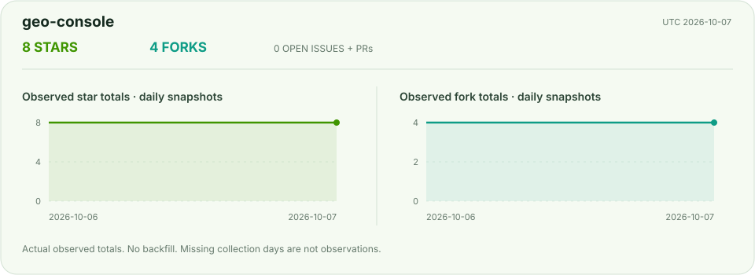</picture>

## grad-project-studio

[Repository](https://github.com/honestTai/grad-project-studio)

<picture><source media="(prefers-color-scheme: dark)" srcset="../assets/metrics/grad-project-studio.svg">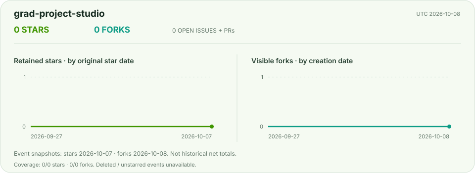</picture>

<picture><source media="(prefers-color-scheme: dark)" srcset="../assets/metrics/grad-project-studio-daily.svg">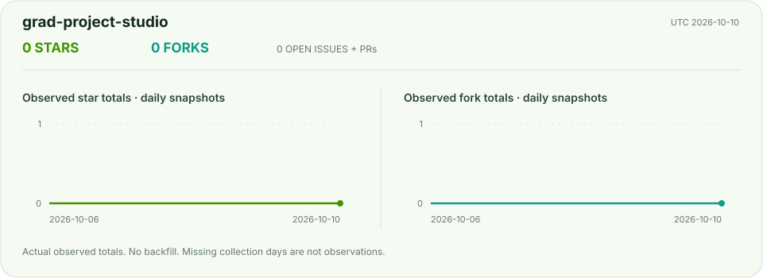</picture>

## honestTai

[Repository](https://github.com/honestTai/honestTai)

<picture><source media="(prefers-color-scheme: dark)" srcset="../assets/metrics/honestTai.svg"></picture>

<picture><source media="(prefers-color-scheme: dark)" srcset="../assets/metrics/honestTai-daily.svg"></picture>

## honestTai-Tool-Xianyu

[Repository](https://github.com/honestTai/honestTai-Tool-Xianyu)

<picture><source media="(prefers-color-scheme: dark)" srcset="../assets/metrics/honestTai-Tool-Xianyu.svg">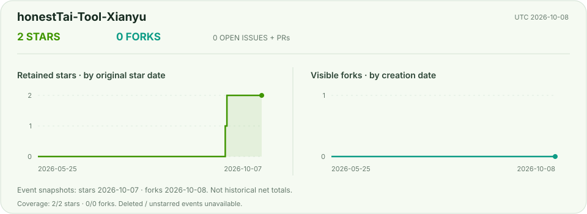</picture>

<picture><source media="(prefers-color-scheme: dark)" srcset="../assets/metrics/honestTai-Tool-Xianyu-daily.svg"></picture>

## HRouter-Desktop

[Repository](https://github.com/honestTai/HRouter-Desktop)

<picture><source media="(prefers-color-scheme: dark)" srcset="../assets/metrics/HRouter-Desktop.svg">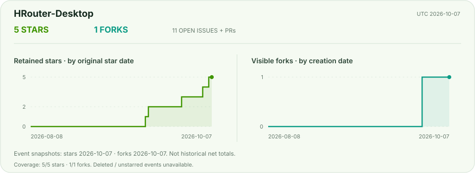</picture>

<picture><source media="(prefers-color-scheme: dark)" srcset="../assets/metrics/HRouter-Desktop-daily.svg">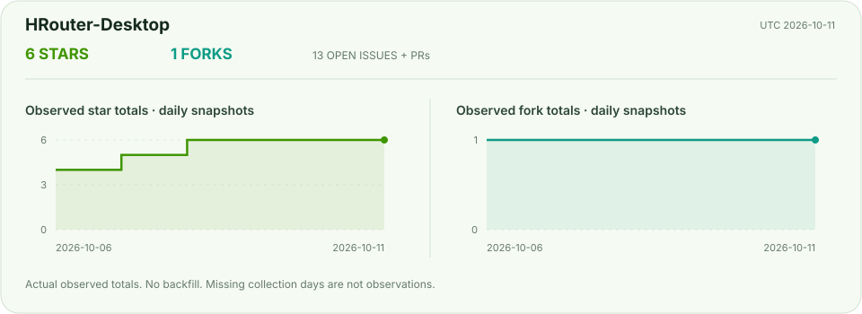</picture>

## hrouter-market-pulse

[Repository](https://github.com/honestTai/hrouter-market-pulse)

<picture><source media="(prefers-color-scheme: dark)" srcset="../assets/metrics/hrouter-market-pulse.svg">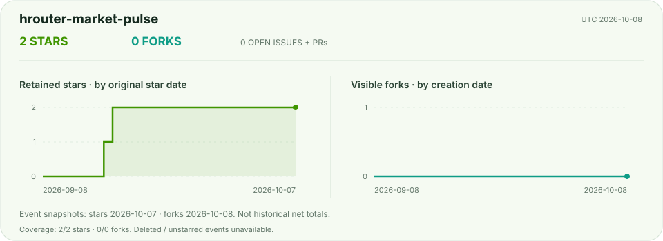</picture>

<picture><source media="(prefers-color-scheme: dark)" srcset="../assets/metrics/hrouter-market-pulse-daily.svg">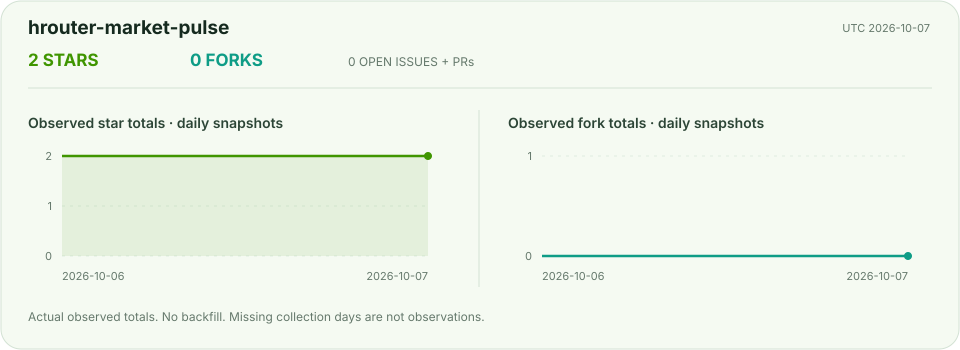</picture>

## rent-project

[Repository](https://github.com/honestTai/rent-project)

<picture><source media="(prefers-color-scheme: dark)" srcset="../assets/metrics/rent-project.svg">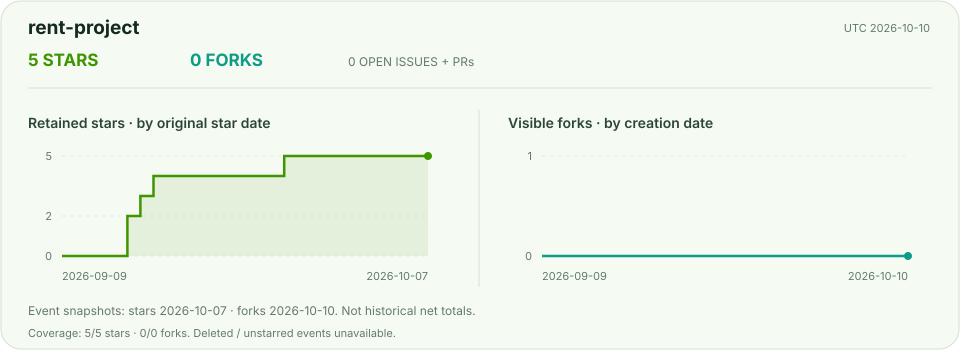</picture>

<picture><source media="(prefers-color-scheme: dark)" srcset="../assets/metrics/rent-project-daily.svg"></picture>

## seedance-movie-mcp

[Repository](https://github.com/honestTai/seedance-movie-mcp)

<picture><source media="(prefers-color-scheme: dark)" srcset="../assets/metrics/seedance-movie-mcp.svg">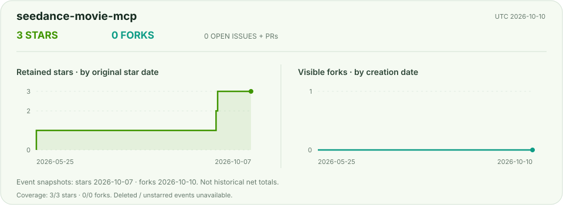</picture>

<picture><source media="(prefers-color-scheme: dark)" srcset="../assets/metrics/seedance-movie-mcp-daily.svg">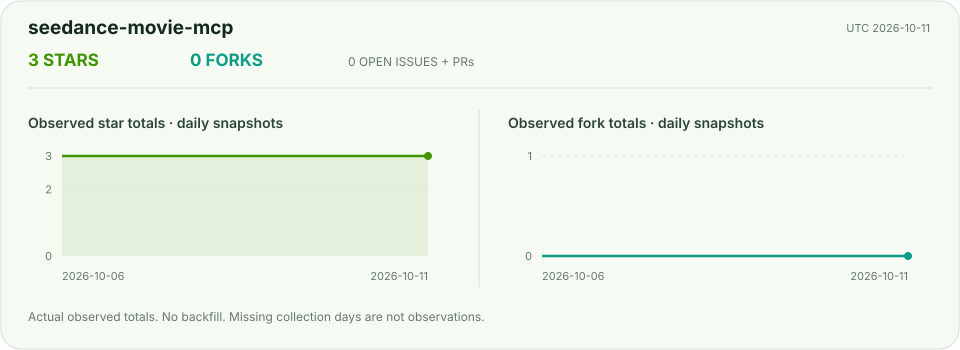</picture>

## seehtml-ai

[Repository](https://github.com/honestTai/seehtml-ai)

<picture><source media="(prefers-color-scheme: dark)" srcset="../assets/metrics/seehtml-ai.svg">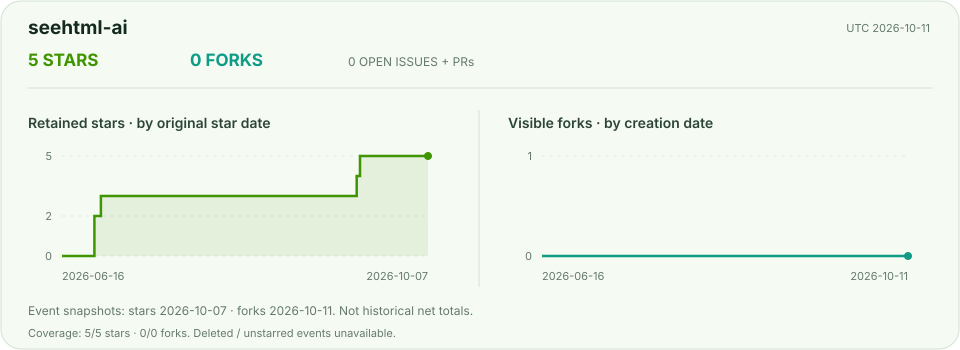</picture>

<picture><source media="(prefers-color-scheme: dark)" srcset="../assets/metrics/seehtml-ai-daily.svg">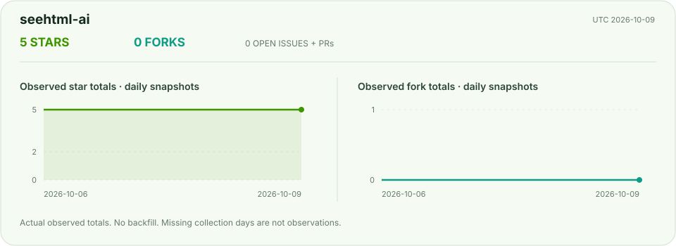</picture>

## sub2api-1

[Repository](https://github.com/honestTai/sub2api-1)

<picture><source media="(prefers-color-scheme: dark)" srcset="../assets/metrics/sub2api-1.svg">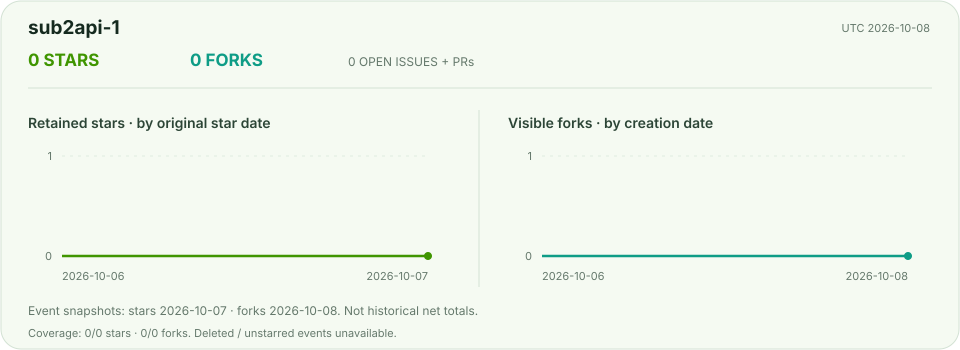</picture>

<picture><source media="(prefers-color-scheme: dark)" srcset="../assets/metrics/sub2api-1-daily.svg">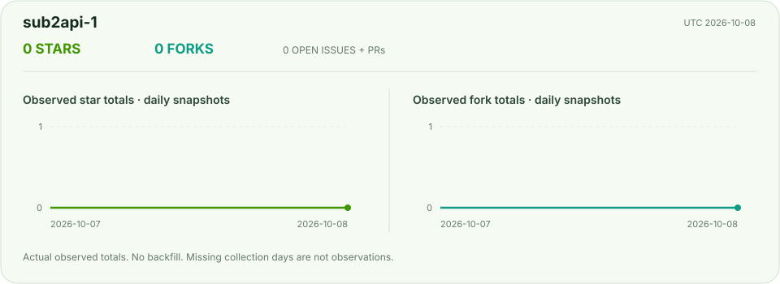</picture>

## tauri-markdown-reader

[Repository](https://github.com/honestTai/tauri-markdown-reader)

<picture><source media="(prefers-color-scheme: dark)" srcset="../assets/metrics/tauri-markdown-reader.svg">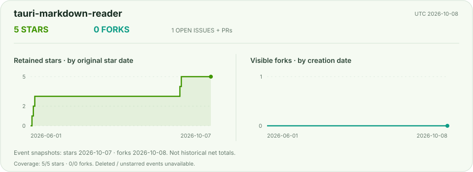</picture>

<picture><source media="(prefers-color-scheme: dark)" srcset="../assets/metrics/tauri-markdown-reader-daily.svg"></picture>

## wechat-shop-netCore

[Repository](https://github.com/honestTai/wechat-shop-netCore)

<picture><source media="(prefers-color-scheme: dark)" srcset="../assets/metrics/wechat-shop-netCore.svg">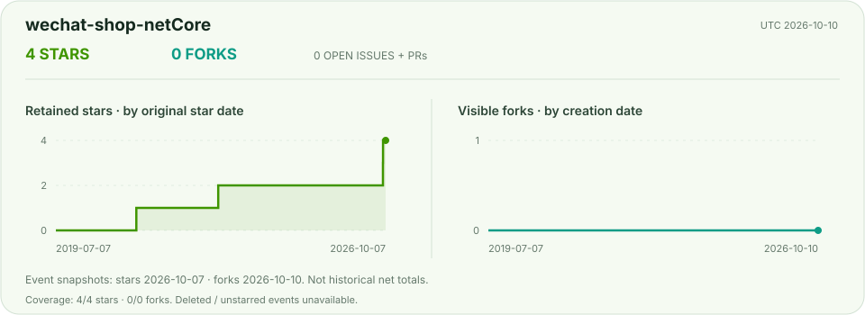</picture>

<picture><source media="(prefers-color-scheme: dark)" srcset="../assets/metrics/wechat-shop-netCore-daily.svg">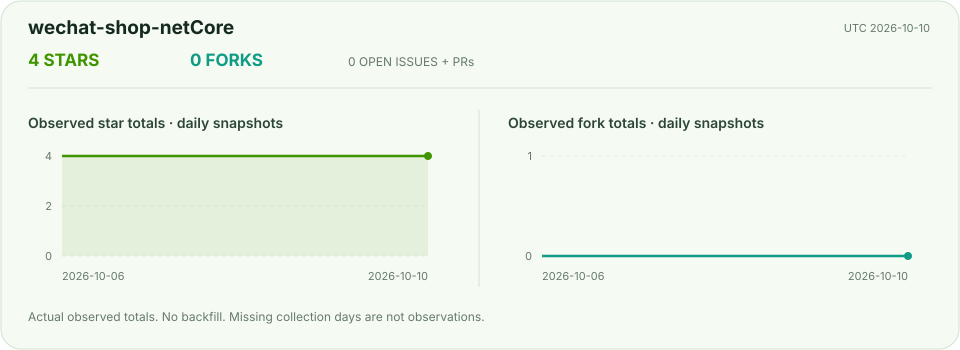</picture>

