# Public repository metrics

[Portfolio](../README.md) · [中文说明](METHODOLOGY.zh-CN.md) · [Methodology](METHODOLOGY.md)

Observed at **2026-10-07T05:13:01Z**. All 15 public repositories, including forks.

## awesome-lint

[Repository](https://github.com/honestTai/awesome-lint)

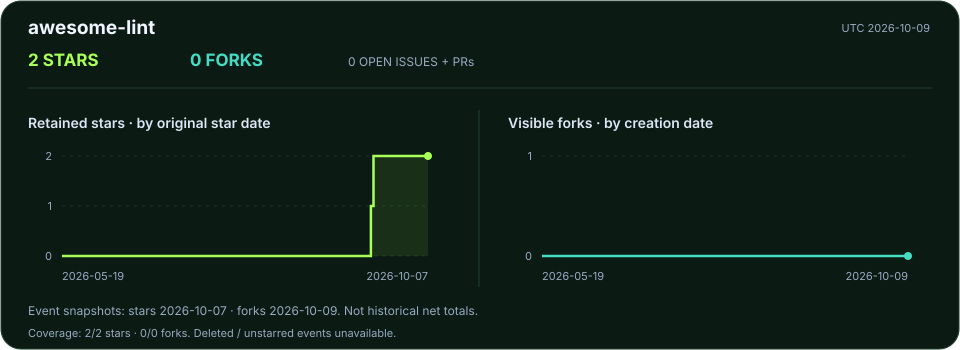

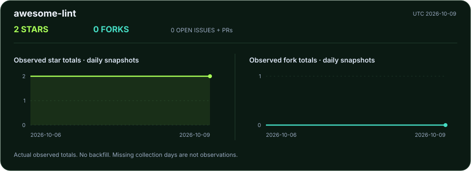

## cc-switch

[Repository](https://github.com/honestTai/cc-switch)

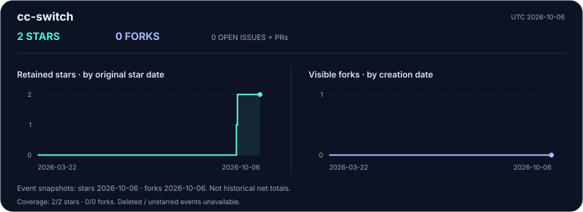

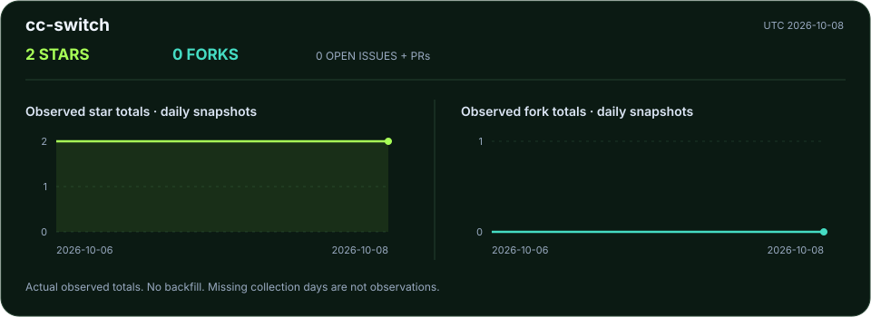

## faliang-codex-ex

[Repository](https://github.com/honestTai/faliang-codex-ex)

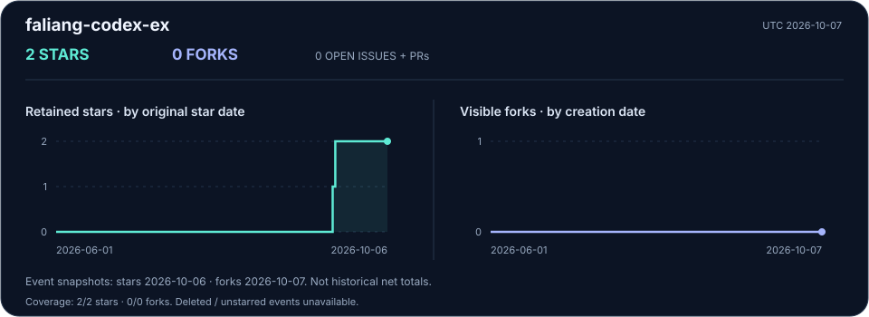

## geo-console

[Repository](https://github.com/honestTai/geo-console)

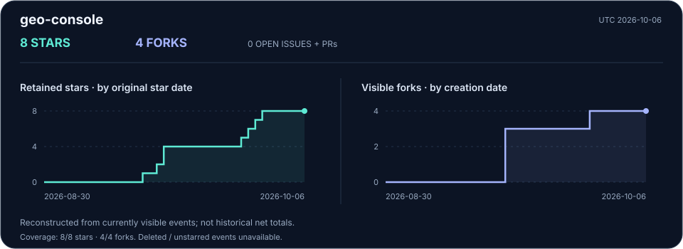

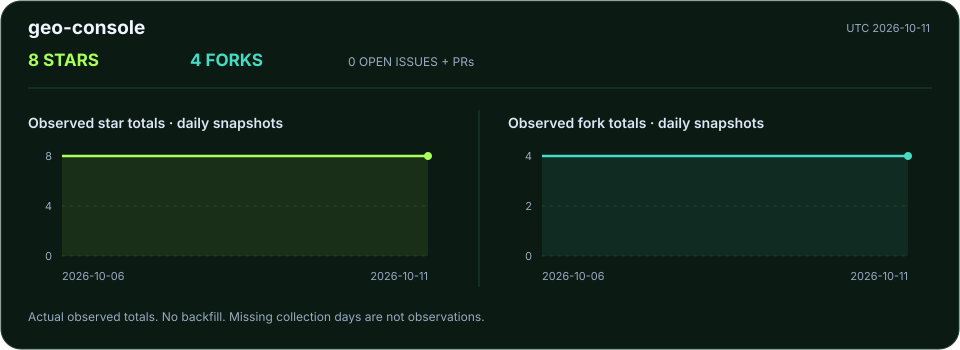

## grad-project-studio

[Repository](https://github.com/honestTai/grad-project-studio)

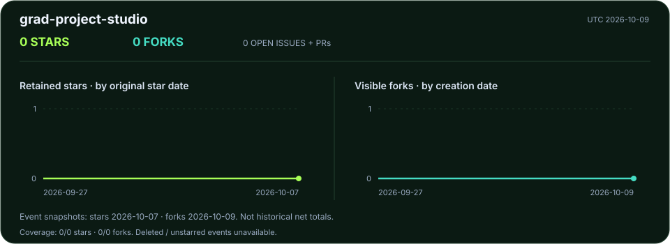

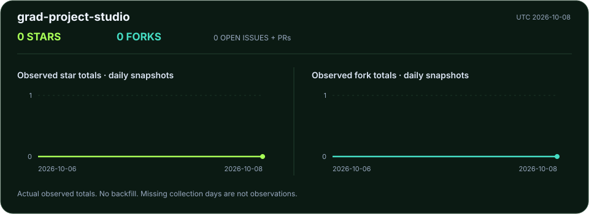

## honestTai

[Repository](https://github.com/honestTai/honestTai)

## honestTai-Tool-Xianyu

[Repository](https://github.com/honestTai/honestTai-Tool-Xianyu)

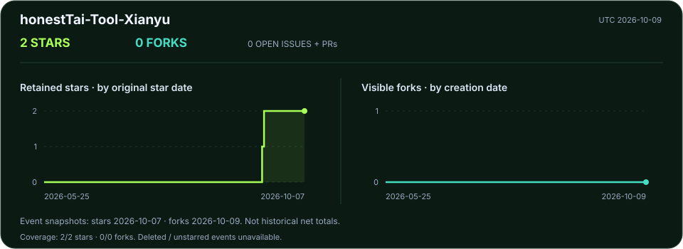

## HRouter-Desktop

[Repository](https://github.com/honestTai/HRouter-Desktop)

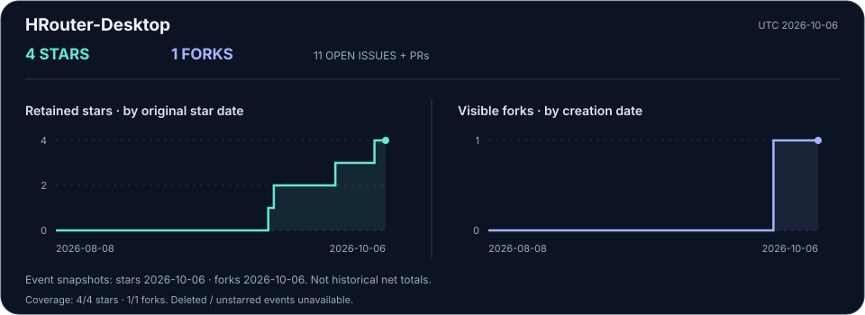

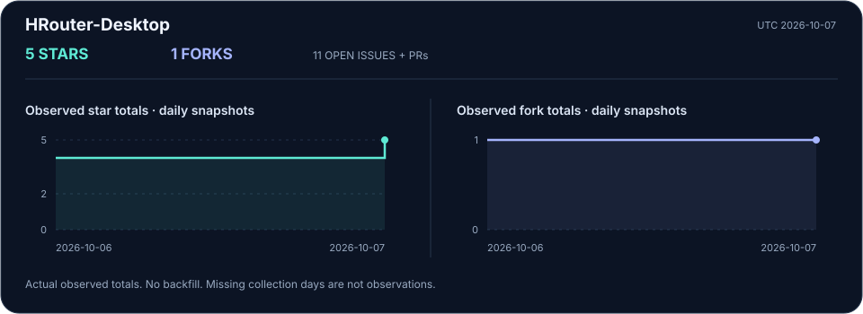

## hrouter-market-pulse

[Repository](https://github.com/honestTai/hrouter-market-pulse)

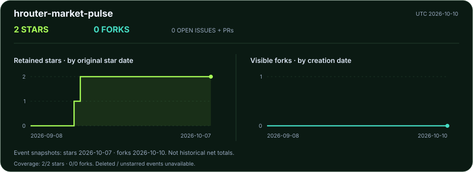

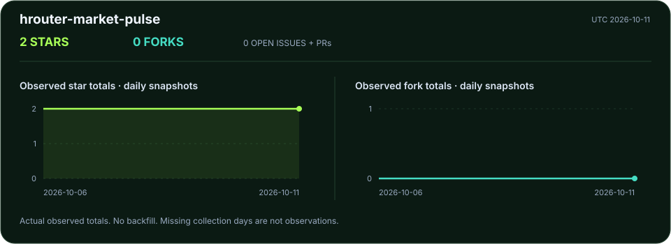

## rent-project

[Repository](https://github.com/honestTai/rent-project)

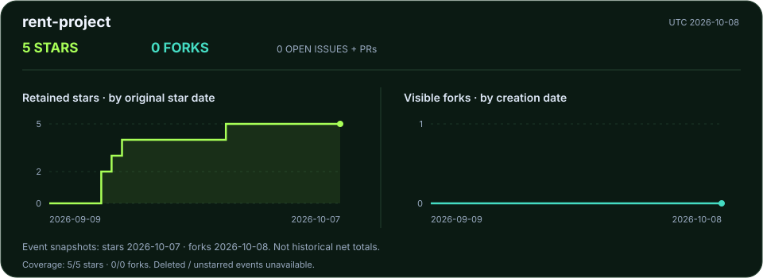

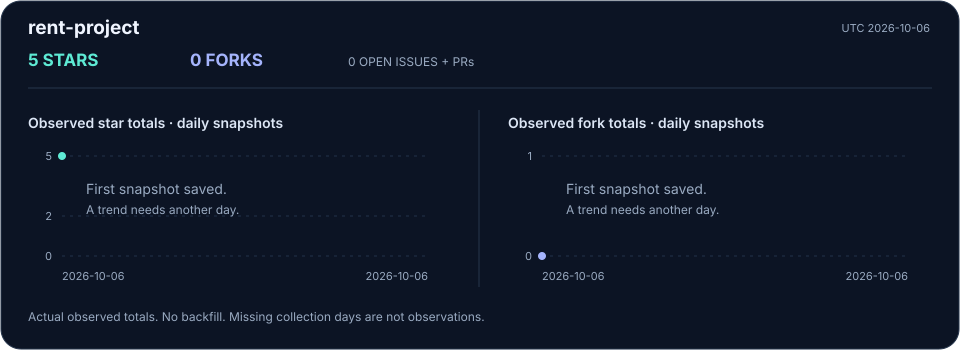

## seedance-movie-mcp

[Repository](https://github.com/honestTai/seedance-movie-mcp)

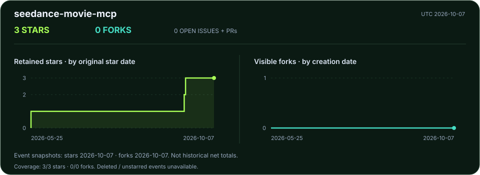

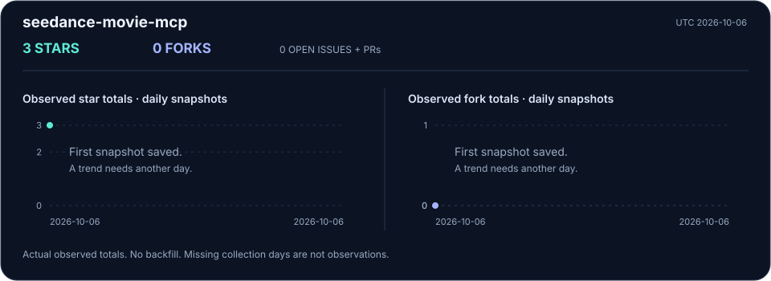

## seehtml-ai

[Repository](https://github.com/honestTai/seehtml-ai)

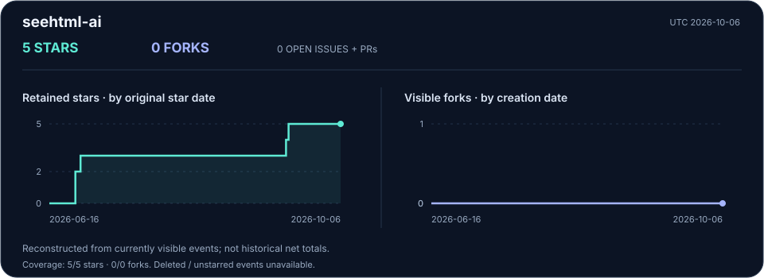

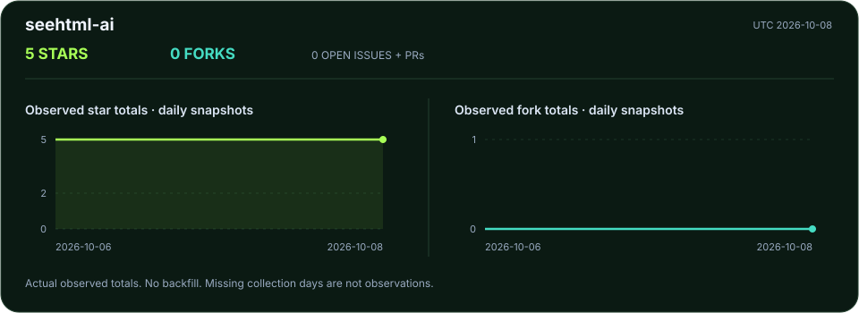

## sub2api-1

[Repository](https://github.com/honestTai/sub2api-1)

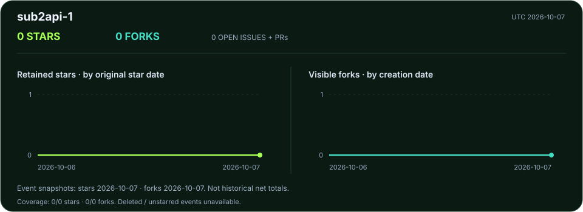

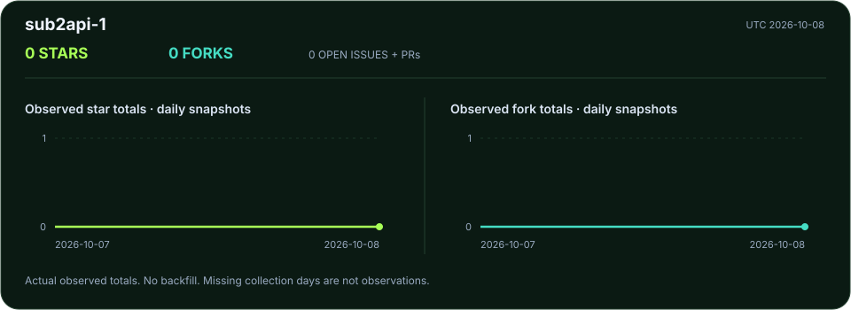

## tauri-markdown-reader

[Repository](https://github.com/honestTai/tauri-markdown-reader)

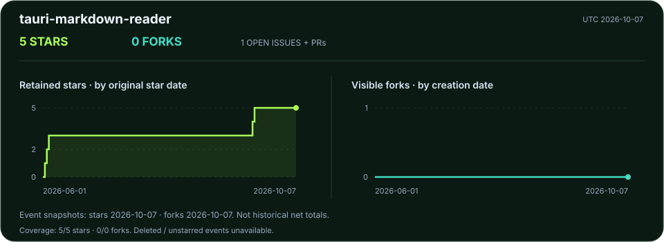

## wechat-shop-netCore

[Repository](https://github.com/honestTai/wechat-shop-netCore)

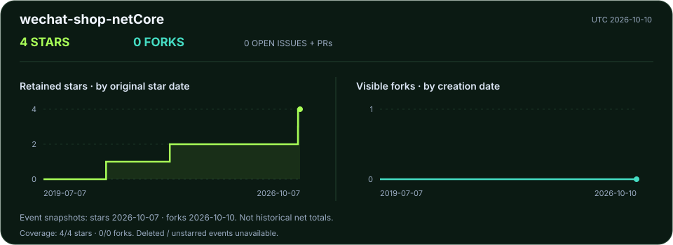

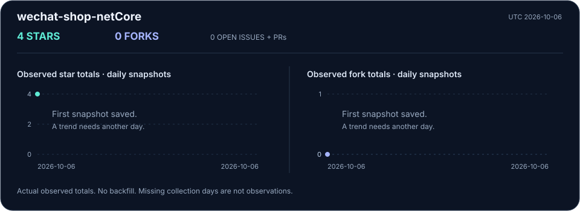

