# Public repository metrics

[Portfolio](../README.md) · [中文说明](METHODOLOGY.zh-CN.md) · [Methodology](METHODOLOGY.md)

Observed at **2026-10-11T01:51:48Z**. All 37 public repositories, including forks.

## awesome-lint

[Repository](https://github.com/honestTai/awesome-lint)

<picture><source media="(prefers-color-scheme: dark)" srcset="../assets/metrics/awesome-lint.svg"></picture>

<picture><source media="(prefers-color-scheme: dark)" srcset="../assets/metrics/awesome-lint-daily.svg"></picture>

## campus-mutual-aid-cs

[Repository](https://github.com/honestTai/campus-mutual-aid-cs)

<picture><source media="(prefers-color-scheme: dark)" srcset="../assets/metrics/campus-mutual-aid-cs.svg">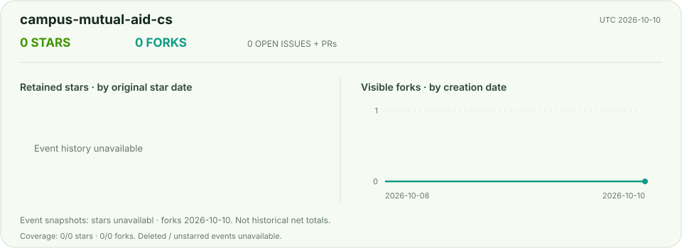</picture>

<picture><source media="(prefers-color-scheme: dark)" srcset="../assets/metrics/campus-mutual-aid-cs-daily.svg">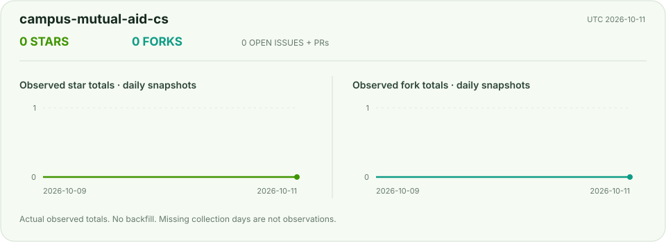</picture>

## campus-mutual-aid-im

[Repository](https://github.com/honestTai/campus-mutual-aid-im)

<picture><source media="(prefers-color-scheme: dark)" srcset="../assets/metrics/campus-mutual-aid-im.svg"></picture>

<picture><source media="(prefers-color-scheme: dark)" srcset="../assets/metrics/campus-mutual-aid-im-daily.svg"></picture>

## cc-switch

[Repository](https://github.com/honestTai/cc-switch)

<picture><source media="(prefers-color-scheme: dark)" srcset="../assets/metrics/cc-switch.svg"></picture>

<picture><source media="(prefers-color-scheme: dark)" srcset="../assets/metrics/cc-switch-daily.svg"></picture>

## collaborative-filtering-food-recommendation

[Repository](https://github.com/honestTai/collaborative-filtering-food-recommendation)

<picture><source media="(prefers-color-scheme: dark)" srcset="../assets/metrics/collaborative-filtering-food-recommendation.svg">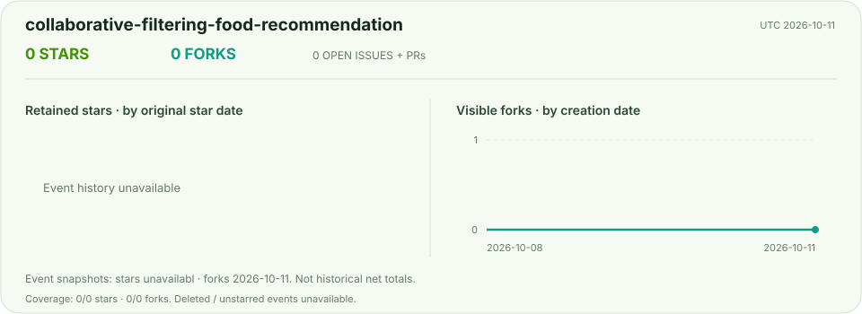</picture>

<picture><source media="(prefers-color-scheme: dark)" srcset="../assets/metrics/collaborative-filtering-food-recommendation-daily.svg">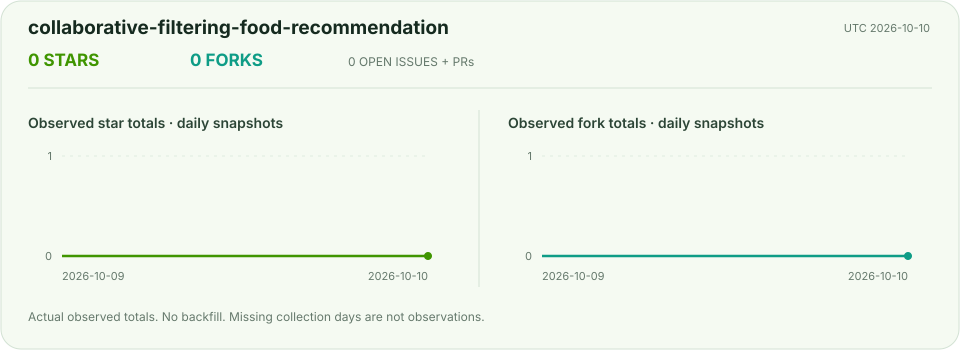</picture>

## cosmetics-ingredients-miniprogram

[Repository](https://github.com/honestTai/cosmetics-ingredients-miniprogram)

<picture><source media="(prefers-color-scheme: dark)" srcset="../assets/metrics/cosmetics-ingredients-miniprogram.svg">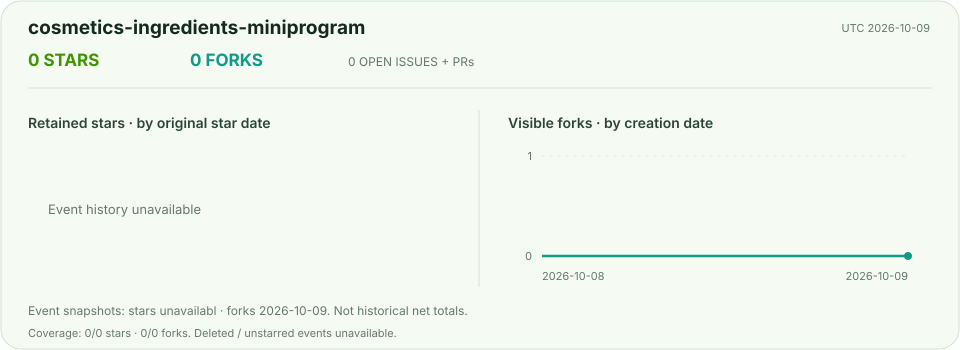</picture>

<picture><source media="(prefers-color-scheme: dark)" srcset="../assets/metrics/cosmetics-ingredients-miniprogram-daily.svg">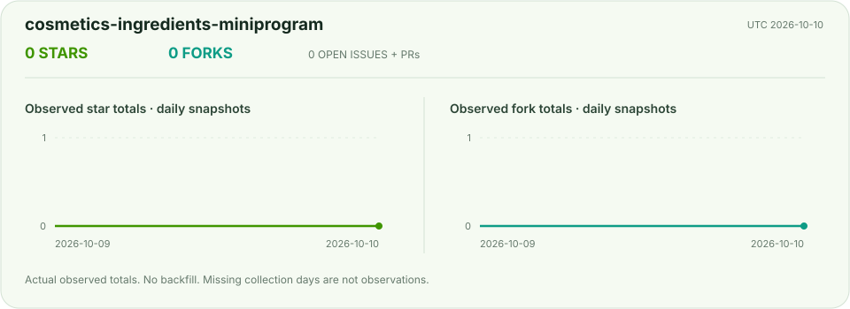</picture>

## faliang-codex-ex

[Repository](https://github.com/honestTai/faliang-codex-ex)

<picture><source media="(prefers-color-scheme: dark)" srcset="../assets/metrics/faliang-codex-ex.svg"></picture>

<picture><source media="(prefers-color-scheme: dark)" srcset="../assets/metrics/faliang-codex-ex-daily.svg"></picture>

## flask-recruitment-visualization

[Repository](https://github.com/honestTai/flask-recruitment-visualization)

<picture><source media="(prefers-color-scheme: dark)" srcset="../assets/metrics/flask-recruitment-visualization.svg">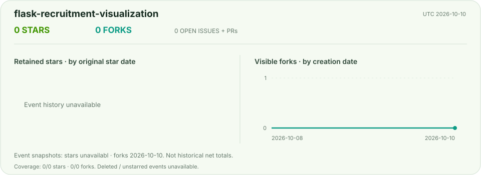</picture>

<picture><source media="(prefers-color-scheme: dark)" srcset="../assets/metrics/flask-recruitment-visualization-daily.svg">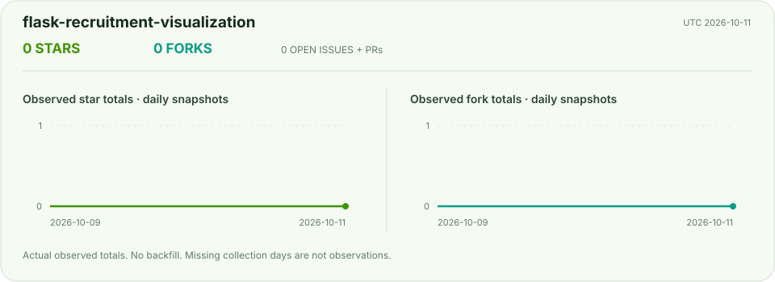</picture>

## geo-console

[Repository](https://github.com/honestTai/geo-console)

<picture><source media="(prefers-color-scheme: dark)" srcset="../assets/metrics/geo-console.svg"></picture>

<picture><source media="(prefers-color-scheme: dark)" srcset="../assets/metrics/geo-console-daily.svg"></picture>

## grad-project-studio

[Repository](https://github.com/honestTai/grad-project-studio)

<picture><source media="(prefers-color-scheme: dark)" srcset="../assets/metrics/grad-project-studio.svg"></picture>

<picture><source media="(prefers-color-scheme: dark)" srcset="../assets/metrics/grad-project-studio-daily.svg"></picture>

## honestTai

[Repository](https://github.com/honestTai/honestTai)

<picture><source media="(prefers-color-scheme: dark)" srcset="../assets/metrics/honestTai.svg"></picture>

<picture><source media="(prefers-color-scheme: dark)" srcset="../assets/metrics/honestTai-daily.svg"></picture>

## honestTai-Tool-Xianyu

[Repository](https://github.com/honestTai/honestTai-Tool-Xianyu)

<picture><source media="(prefers-color-scheme: dark)" srcset="../assets/metrics/honestTai-Tool-Xianyu.svg"></picture>

<picture><source media="(prefers-color-scheme: dark)" srcset="../assets/metrics/honestTai-Tool-Xianyu-daily.svg"></picture>

## house-price-bigdata-analysis

[Repository](https://github.com/honestTai/house-price-bigdata-analysis)

<picture><source media="(prefers-color-scheme: dark)" srcset="../assets/metrics/house-price-bigdata-analysis.svg"></picture>

<picture><source media="(prefers-color-scheme: dark)" srcset="../assets/metrics/house-price-bigdata-analysis-daily.svg">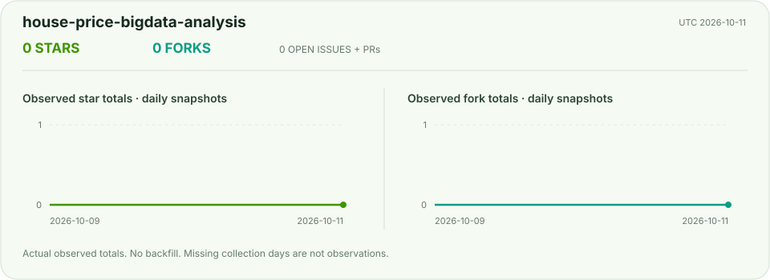</picture>

## house-price-ml-visualization

[Repository](https://github.com/honestTai/house-price-ml-visualization)

<picture><source media="(prefers-color-scheme: dark)" srcset="../assets/metrics/house-price-ml-visualization.svg"></picture>

<picture><source media="(prefers-color-scheme: dark)" srcset="../assets/metrics/house-price-ml-visualization-daily.svg"></picture>

## HRouter-Desktop

[Repository](https://github.com/honestTai/HRouter-Desktop)

<picture><source media="(prefers-color-scheme: dark)" srcset="../assets/metrics/HRouter-Desktop.svg"></picture>

<picture><source media="(prefers-color-scheme: dark)" srcset="../assets/metrics/HRouter-Desktop-daily.svg"></picture>

## hrouter-market-pulse

[Repository](https://github.com/honestTai/hrouter-market-pulse)

<picture><source media="(prefers-color-scheme: dark)" srcset="../assets/metrics/hrouter-market-pulse.svg"></picture>

<picture><source media="(prefers-color-scheme: dark)" srcset="../assets/metrics/hrouter-market-pulse-daily.svg"></picture>

## microservices-community-errand

[Repository](https://github.com/honestTai/microservices-community-errand)

<picture><source media="(prefers-color-scheme: dark)" srcset="../assets/metrics/microservices-community-errand.svg">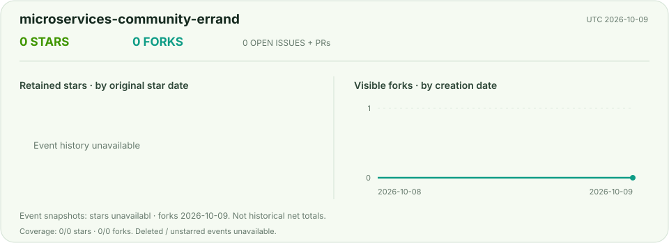</picture>

<picture><source media="(prefers-color-scheme: dark)" srcset="../assets/metrics/microservices-community-errand-daily.svg">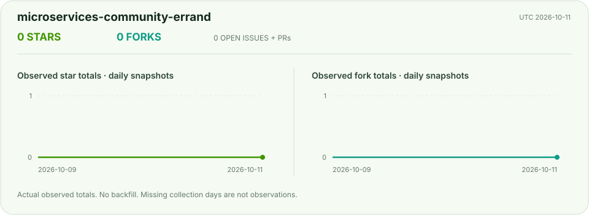</picture>

## php-property-management

[Repository](https://github.com/honestTai/php-property-management)

<picture><source media="(prefers-color-scheme: dark)" srcset="../assets/metrics/php-property-management.svg">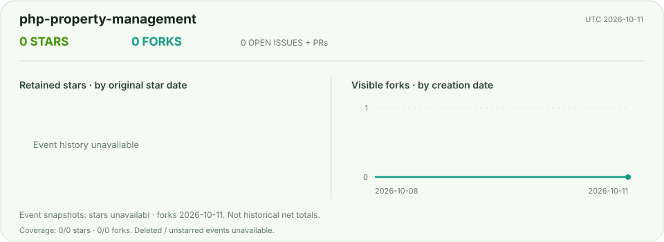</picture>

<picture><source media="(prefers-color-scheme: dark)" srcset="../assets/metrics/php-property-management-daily.svg">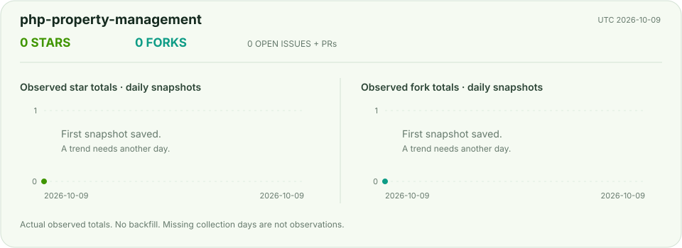</picture>

## python-novel-data-analysis

[Repository](https://github.com/honestTai/python-novel-data-analysis)

<picture><source media="(prefers-color-scheme: dark)" srcset="../assets/metrics/python-novel-data-analysis.svg"></picture>

<picture><source media="(prefers-color-scheme: dark)" srcset="../assets/metrics/python-novel-data-analysis-daily.svg"></picture>

## python-web-security-scanner

[Repository](https://github.com/honestTai/python-web-security-scanner)

<picture><source media="(prefers-color-scheme: dark)" srcset="../assets/metrics/python-web-security-scanner.svg">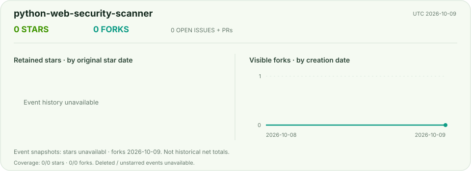</picture>

<picture><source media="(prefers-color-scheme: dark)" srcset="../assets/metrics/python-web-security-scanner-daily.svg">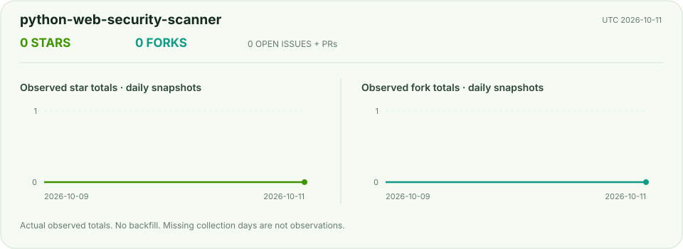</picture>

## recruitment-data-visualization

[Repository](https://github.com/honestTai/recruitment-data-visualization)

<picture><source media="(prefers-color-scheme: dark)" srcset="../assets/metrics/recruitment-data-visualization.svg"></picture>

<picture><source media="(prefers-color-scheme: dark)" srcset="../assets/metrics/recruitment-data-visualization-daily.svg">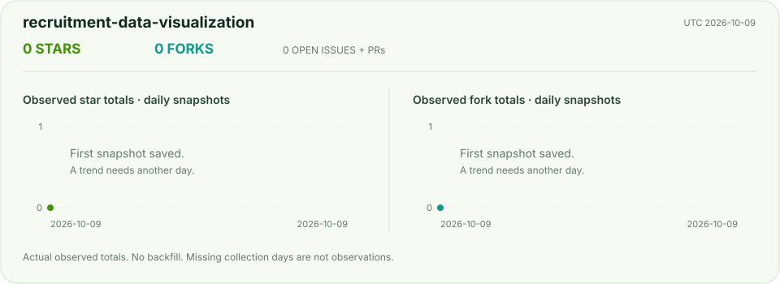</picture>

## rent-project

[Repository](https://github.com/honestTai/rent-project)

<picture><source media="(prefers-color-scheme: dark)" srcset="../assets/metrics/rent-project.svg"></picture>

<picture><source media="(prefers-color-scheme: dark)" srcset="../assets/metrics/rent-project-daily.svg"></picture>

## seedance-movie-mcp

[Repository](https://github.com/honestTai/seedance-movie-mcp)

<picture><source media="(prefers-color-scheme: dark)" srcset="../assets/metrics/seedance-movie-mcp.svg"></picture>

<picture><source media="(prefers-color-scheme: dark)" srcset="../assets/metrics/seedance-movie-mcp-daily.svg"></picture>

## seehtml-ai

[Repository](https://github.com/honestTai/seehtml-ai)

<picture><source media="(prefers-color-scheme: dark)" srcset="../assets/metrics/seehtml-ai.svg"></picture>

<picture><source media="(prefers-color-scheme: dark)" srcset="../assets/metrics/seehtml-ai-daily.svg"></picture>

## spark-takeaway-data-analysis

[Repository](https://github.com/honestTai/spark-takeaway-data-analysis)

<picture><source media="(prefers-color-scheme: dark)" srcset="../assets/metrics/spark-takeaway-data-analysis.svg"></picture>

<picture><source media="(prefers-color-scheme: dark)" srcset="../assets/metrics/spark-takeaway-data-analysis-daily.svg">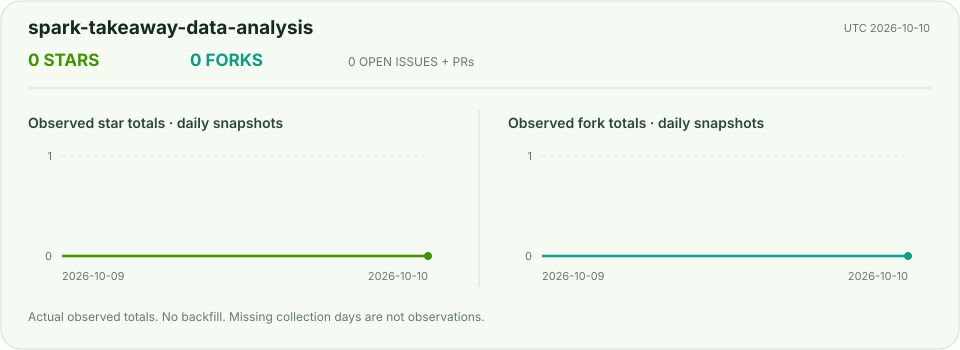</picture>

## springboot-building-materials

[Repository](https://github.com/honestTai/springboot-building-materials)

<picture><source media="(prefers-color-scheme: dark)" srcset="../assets/metrics/springboot-building-materials.svg"></picture>

<picture><source media="(prefers-color-scheme: dark)" srcset="../assets/metrics/springboot-building-materials-daily.svg"></picture>

## springboot-pet-adoption

[Repository](https://github.com/honestTai/springboot-pet-adoption)

<picture><source media="(prefers-color-scheme: dark)" srcset="../assets/metrics/springboot-pet-adoption.svg">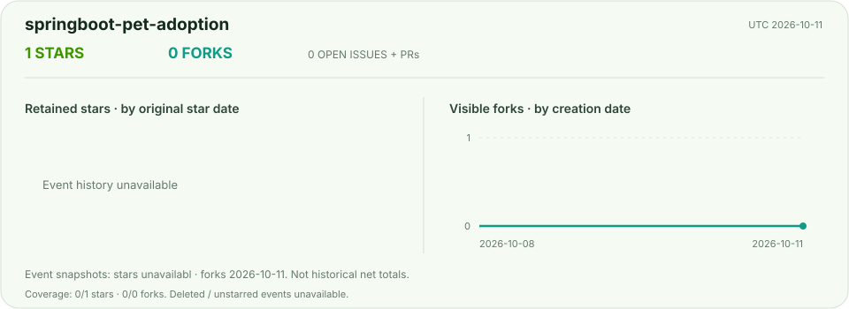</picture>

<picture><source media="(prefers-color-scheme: dark)" srcset="../assets/metrics/springboot-pet-adoption-daily.svg">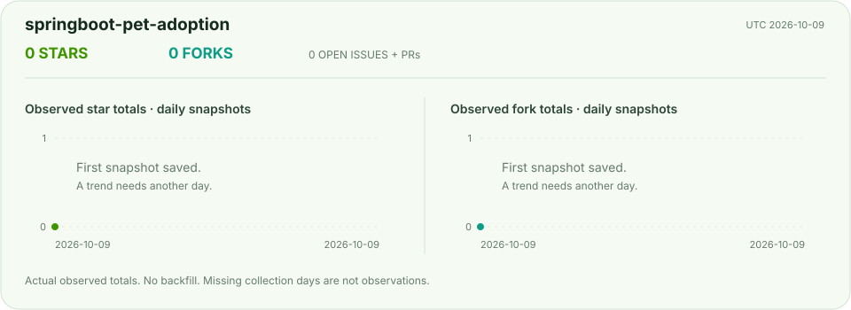</picture>

## sub2api-1

[Repository](https://github.com/honestTai/sub2api-1)

<picture><source media="(prefers-color-scheme: dark)" srcset="../assets/metrics/sub2api-1.svg"></picture>

<picture><source media="(prefers-color-scheme: dark)" srcset="../assets/metrics/sub2api-1-daily.svg"></picture>

## tauri-markdown-reader

[Repository](https://github.com/honestTai/tauri-markdown-reader)

<picture><source media="(prefers-color-scheme: dark)" srcset="../assets/metrics/tauri-markdown-reader.svg"></picture>

<picture><source media="(prefers-color-scheme: dark)" srcset="../assets/metrics/tauri-markdown-reader-daily.svg"></picture>

## tourism-perception-bigdata

[Repository](https://github.com/honestTai/tourism-perception-bigdata)

<picture><source media="(prefers-color-scheme: dark)" srcset="../assets/metrics/tourism-perception-bigdata.svg"></picture>

<picture><source media="(prefers-color-scheme: dark)" srcset="../assets/metrics/tourism-perception-bigdata-daily.svg">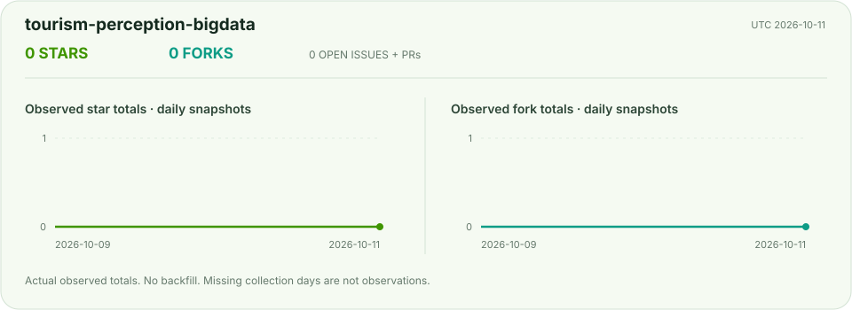</picture>

## vue-community-food-ordering

[Repository](https://github.com/honestTai/vue-community-food-ordering)

<picture><source media="(prefers-color-scheme: dark)" srcset="../assets/metrics/vue-community-food-ordering.svg"></picture>

<picture><source media="(prefers-color-scheme: dark)" srcset="../assets/metrics/vue-community-food-ordering-daily.svg">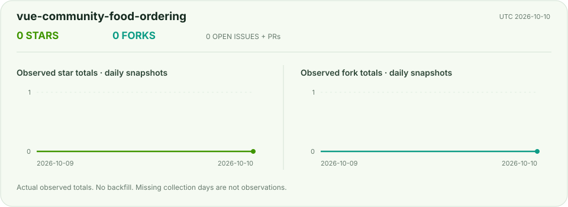</picture>

## vue-game-company-website

[Repository](https://github.com/honestTai/vue-game-company-website)

<picture><source media="(prefers-color-scheme: dark)" srcset="../assets/metrics/vue-game-company-website.svg">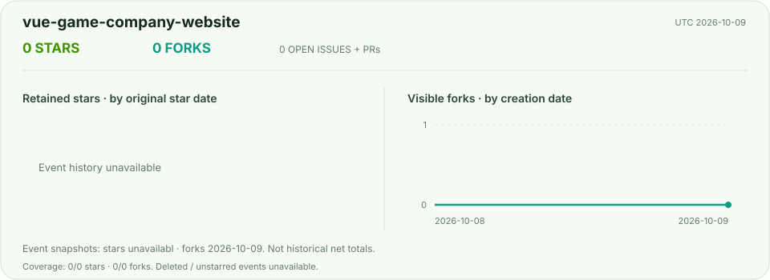</picture>

<picture><source media="(prefers-color-scheme: dark)" srcset="../assets/metrics/vue-game-company-website-daily.svg">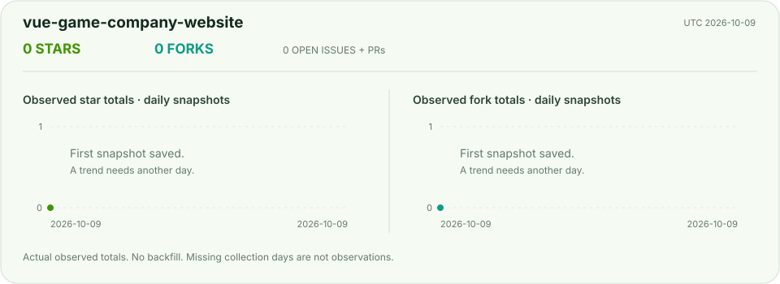</picture>

## vue-library-management

[Repository](https://github.com/honestTai/vue-library-management)

<picture><source media="(prefers-color-scheme: dark)" srcset="../assets/metrics/vue-library-management.svg">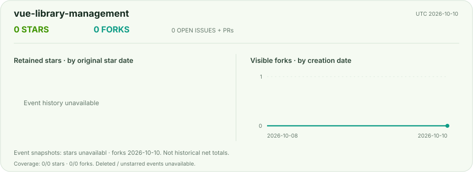</picture>

<picture><source media="(prefers-color-scheme: dark)" srcset="../assets/metrics/vue-library-management-daily.svg"></picture>

## vue-springboot-gym-management

[Repository](https://github.com/honestTai/vue-springboot-gym-management)

<picture><source media="(prefers-color-scheme: dark)" srcset="../assets/metrics/vue-springboot-gym-management.svg">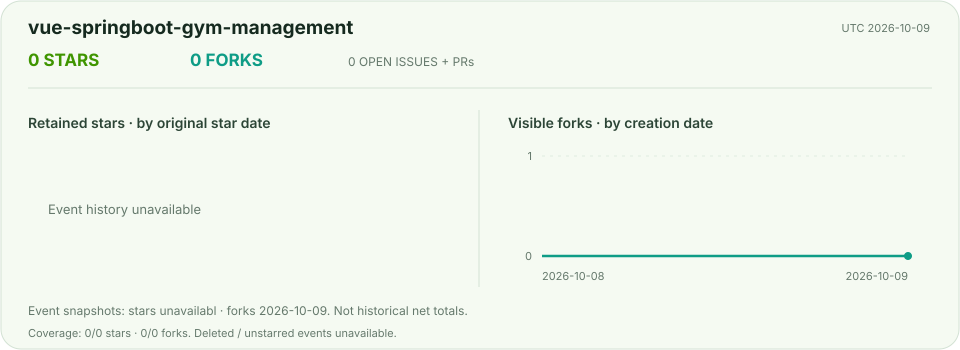</picture>

<picture><source media="(prefers-color-scheme: dark)" srcset="../assets/metrics/vue-springboot-gym-management-daily.svg"></picture>

## vue-springboot-photo-sharing

[Repository](https://github.com/honestTai/vue-springboot-photo-sharing)

<picture><source media="(prefers-color-scheme: dark)" srcset="../assets/metrics/vue-springboot-photo-sharing.svg">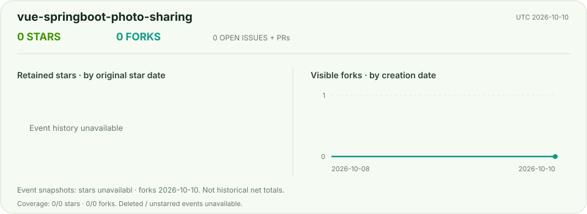</picture>

<picture><source media="(prefers-color-scheme: dark)" srcset="../assets/metrics/vue-springboot-photo-sharing-daily.svg"></picture>

## wechat-shop-netCore

[Repository](https://github.com/honestTai/wechat-shop-netCore)

<picture><source media="(prefers-color-scheme: dark)" srcset="../assets/metrics/wechat-shop-netCore.svg"></picture>

<picture><source media="(prefers-color-scheme: dark)" srcset="../assets/metrics/wechat-shop-netCore-daily.svg"></picture>

## zongheng-novel-bigdata-analysis

[Repository](https://github.com/honestTai/zongheng-novel-bigdata-analysis)

<picture><source media="(prefers-color-scheme: dark)" srcset="../assets/metrics/zongheng-novel-bigdata-analysis.svg">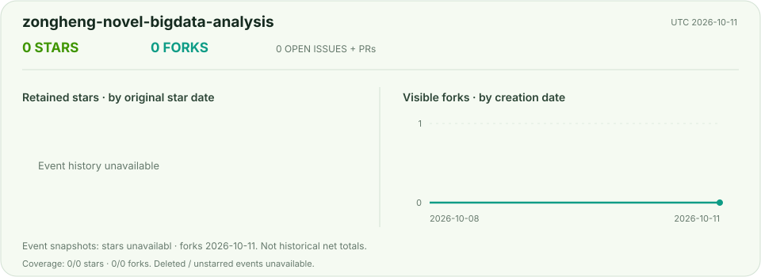</picture>

<picture><source media="(prefers-color-scheme: dark)" srcset="../assets/metrics/zongheng-novel-bigdata-analysis-daily.svg"></picture>

